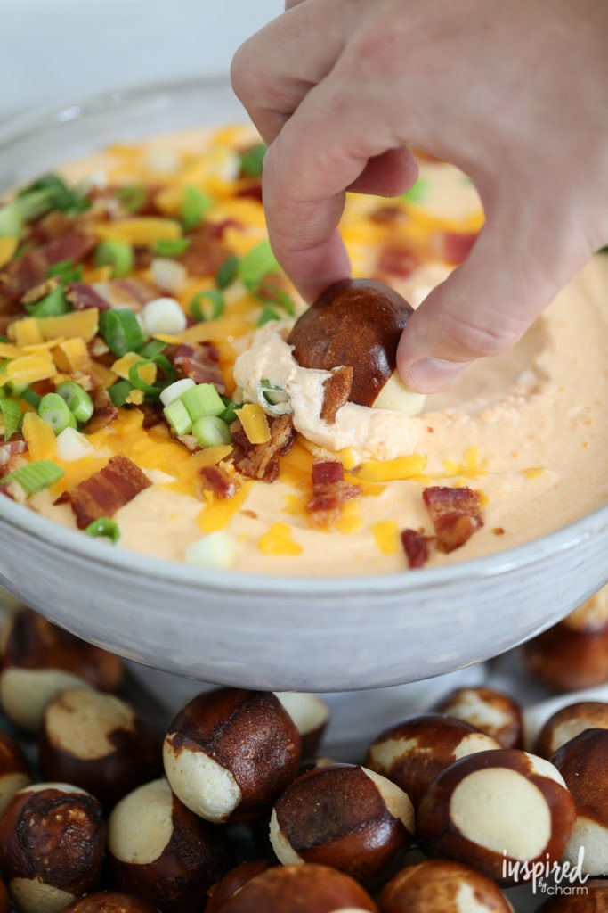

# Сырный дип с пивом и беконом

###### Ингредиенты:

* 500 г сливочного сыра
* 30 г сметаны
* 2 столовые ложки дижонской горчицы
* 1 чайная ложка чесночного порошка
* 300 мл эмбер эля или лагера
* 350 г тертого сыра чеддер
* 300 г бекона
* 60 г густых сливок

#### Приготовление:

Бекон обжарить до хрустящести и мелко нарезать.

В сотейнике смешать сливочный сыр, сметану, горчицу, чесночный порошок, пиво, чеддер и примерно 1/4 чашки бекона.

Варить помешивая на медленном огне, пока смесь не станет однородной, незадолго до подачи добавить взбитые сливки.

Перед подачей добавить оставшийся бекон. Подавать с крендельками или кубиками хлеба.

[_https://inspiredbycharm.com/beer-cheese-dip-with-bacon/_](https://inspiredbycharm.com/beer-cheese-dip-with-bacon/)

