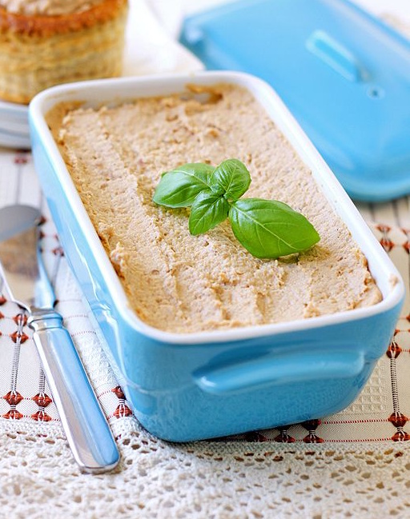

---
image: ../../pics/egg-pate.jpg
---
# Паштет из яиц

#### Ингредиенты

* 4 яйца
* 50 г измельченных грецких орехов
* 2 ст. л. растительного масла
* соль и перец по вкусу

#### Приготовление

Отварить яйца вкрутую, в блендере или процессоре измельчить яйца, масло и орехи на высокой скорости до однородной массы.

Посолить и поперчить по вкусу, перемешать. Переложить смесь в миску, накрыть, перед подачей охладить.

Подавать на тостах или крекерах.

_lg: elena-fialka_

