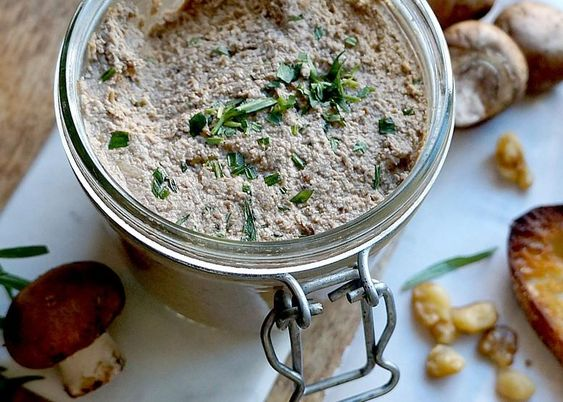

# Паштет из грибов

#### Ингредиенты

* Грибы 500 г
* Сливки 30% 30 мл
* Сливочное масло 1 20 г
* Сливочное масло 2 60 г
* Сливочное масло 3 20 г
* Молоко 60 мл
* Чеснок 20 г
* Белое вино 60 мл
* Белый хлеб 30 г
* Тимьян, соль, перец, мускатный орех по вкусу

#### Приготовление

В глубокой сковороде разогреть сливочное масло 1 с тимьяном, обжарить грибы до полуготовности. Добавить соль, перец, мускат и чеснок. Влить в грибы белое вино, выпарить его на огне. Влить в сковороду сливки и, помешивая, дождаться, пока и они впитаются в грибы.

С белого хлеба срезать корочки, а мякоть — размочить в молоке и отжать. Грибы и хлебную мякоть пробить в блендере до однородности. Размягченное сливочное масло 2 взбить миксером добела, добавить в смесь гри­бов и хлеба и размешать до однородности.

Разогреть духовку до 150 градусов. Переложить паштет в форму, утрамбовать и запечь в духовке 15-20 ми­нут.

Вынуть паштет из духовки, остудить. Залить растопленным сливочным маслом, выдержать в холодильнике сутки.

_eda.ru_

