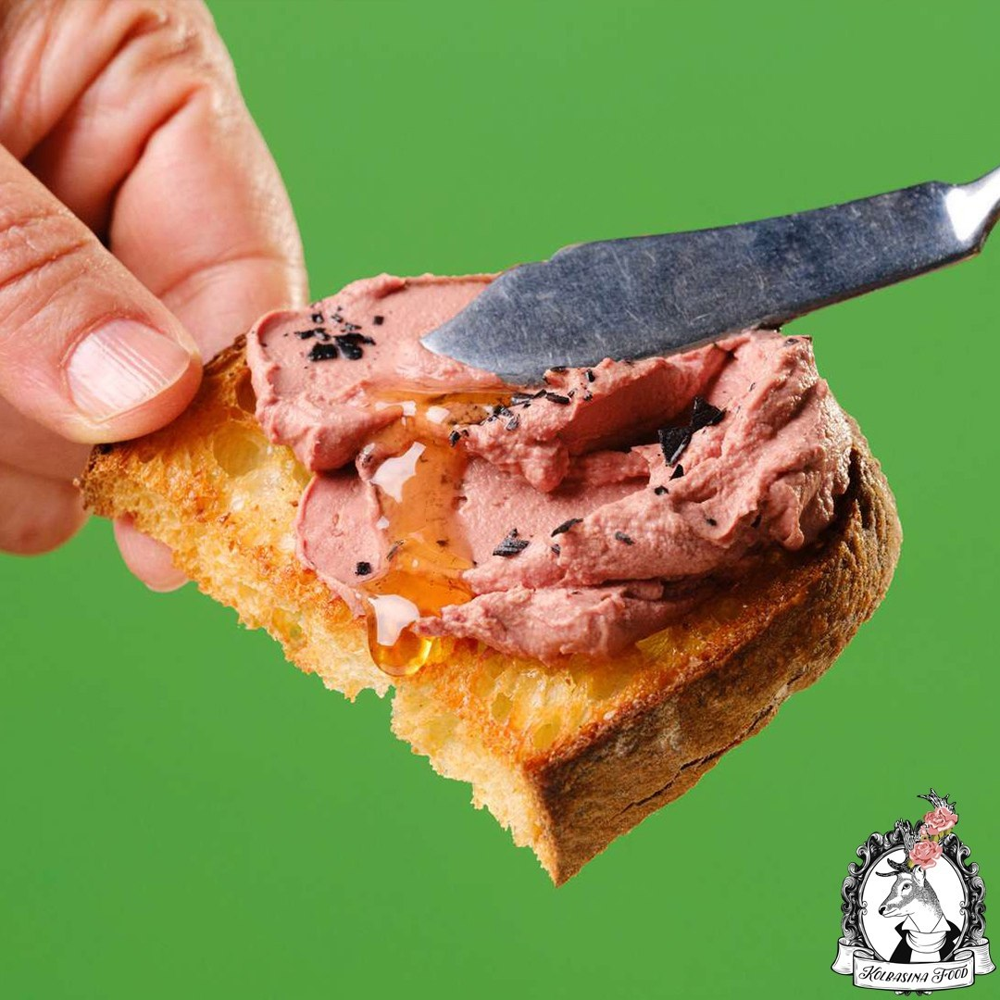

# Пряный паштет из куриной печени

Такой паштет можно подать как закуску,в мини-формочках,с тостами из черного хлеба или с печеньем крекер!

#### Ингредиенты

* Бекон - 100г
* Лук - 200г
* Шалот - 50г
* Белый сухой портвейн - 100г
* Мадера - 100г
* Яблочный бренди - 50г
* Куриная печень - 500г
* Яйца - 200г
* Соль - 15г
* Нитритная соль - 2,5г
* Молотый черный перец - 0.5г
* Сладкая смесь специй (корица, кардамон, махляб, мускатный орех, молотый имбирь) - 0,8г
* Растопленное сливочное масло или масло гхи - 100г
* 50 гр сливочного масла\(для заливки паштета\)

#### Приготовление

Бекон, лук и шалот нарезать кубиком. В сковороде с толстым дном на среднем огне обжарить бекон, лук и лук-шалот до мягкости и прозрачности.  
Добавить алкоголь и кипятить около минуты, периодически помешивая. Выключите нагрев и дайте отдохнуть около 10 минут, чтобы настоялись ароматы.  
Процедить содержимое через шиноа или другое мелкое сито, чтобы извлечь как можно больше жидкости из гущи. Должно получится около 150г ароматной жидкости.  

Печень обжарить, смешать с остальными ингредиентами и жидкостью. Готовить в сувид в предварительно нагретой воде при 60С 90 минут.

Пробить до однородности, около 2 минут. Когда печень будет тщательно пробита блендером, медленно влить сливочное масло, продолжая пробивать, чтобы получить гладкую эмульсию. Остудить и залить растопленным сливочным маслом. Поставить в холодильник для стабилизации на 3 часа.

_ChefSteps_
