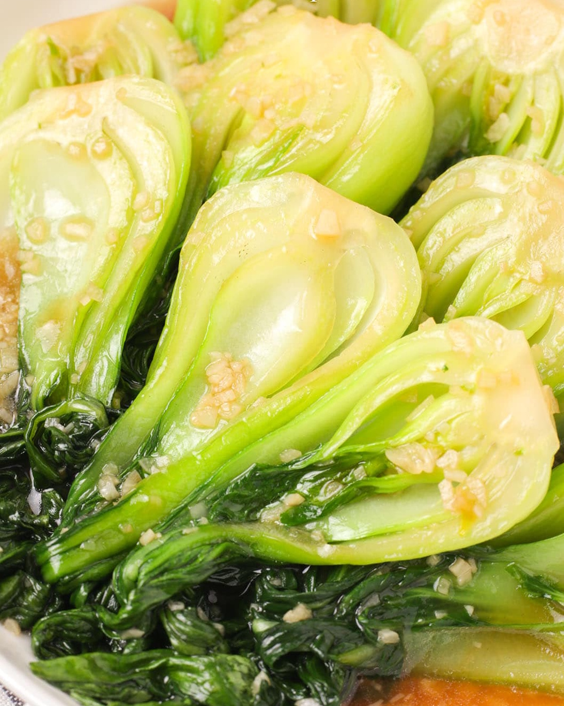

---
image: ../pics/bok-choy.jpg
---
# Пак-чой в устричном соусе

#### Ингредиенты

* пак-чой 500 г
* растительное масло 15 г
* чеснок
* устричный соус 40 г
* сахар 1/4 ч л
* крахмал 10 г

#### Приготовление

Обрезать корень пак-чой по мере необходимости, но не слишком много, чтобы листья остались целыми, разрезать вдоль на половинки или четвертинки, вымыть и оставить в ледяной воде.

Опустить в кипящую воду и бланшировать около минуты, основание погрузить чуть раньше чем листья. Затем вернуть в ледяную воду.

В миске соединить в эмульсию воду, устричный соус, сахар и кукурузный крахмал. 

В воке на среднем огне разогреть масло, добавить чеснок и готовить до появления аромата.
Хорошо перемешать приготовленный соус и вылить в вок, прогреть до загустения, часто помешивая. Добавить подготовленный пак-чой и перемешать, равномерно покрыв соусом.

*tiktok: two_plaid_aprons*
