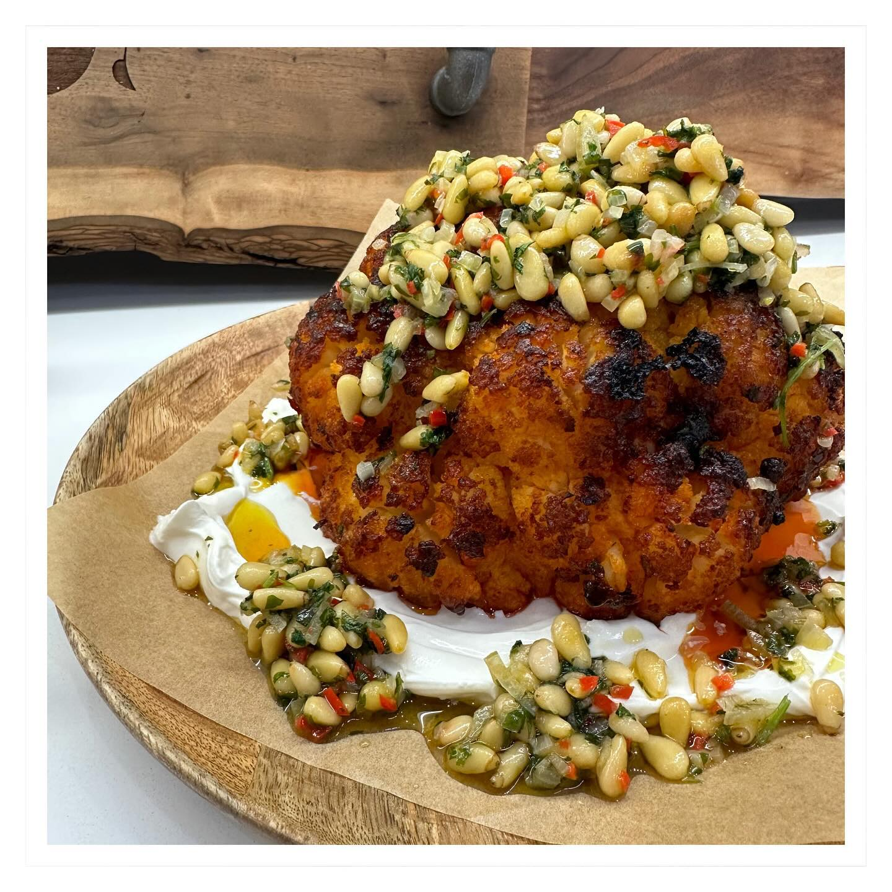

---
image: ../pics/cauliflower.jpg
---
# Запеченная цветная капуста в соусе харисса

#### Ингредиенты

* большая цветная капуста
* 1/2 чили
* пучок кинзы
* кедровые орешки
* шалот

**для маринада:**

* паста харисса 2 чл
* паприка 1 чл
* мед 1 чл
* растительное масло 1 чл

**для соуса:**

* йогурт 250 г
* зубчик чеснока
* сок 1/4 лимона
* ксантановая камедь 1/2 (для загущения)

**для заправки:**

* 2 части тахини
* 1 часть соевого соуса
* 3 части воды

#### Приготовление

Удалите листья и основание цветной капусты. В кастрюлю налить воду до половины капусты примерно, довести до кипения, опустить капусту целиком и варить на пару 5 минут.

Смешать все ингредиенты маринада. Цветную капусту вынуть и обсушить. Обмазать маринадом, запекать при температуре 170 С до хрустящей корочки, но не до коричневого цвета, примерно 40 минут.  
Смешать заправку.  
Мелко нарезать шалот, кинзу и чили, обжарить вместе с кедровыми орешками.  

Для подачи выложить на тарелку йогурт, затем цветную капусту, сбрызнуть заправкой и посыпать орешками.

*Tiktok: ameliasandy*
