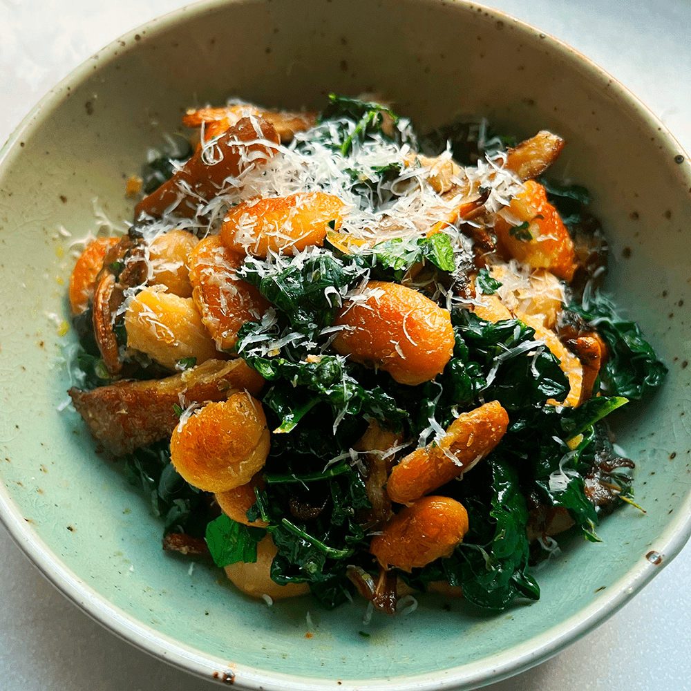

---
image: ../pics/crispy-butter-beans.png
---
# Хрустящая фасоль с грибами и пармезаном

#### Ингредиенты
на 2 порции

* грибы 300 г
* белая фасоль лима 300 г
* шпинат или кейл
* петрушка
* половина лимона
* пармезан
* оливковое масло
* сливочное масло
* тимьян, соль, перец по вкусу

#### Приготовление

Разогреть сковороду на сильном огне с небольшим количеством масла. Когда она нагреется, добавить фасоль, обжарить, периодически помешивая, отложить в тарелку. 

Обжарить грибы со сливочным маслом и тимьяном до слегка золотистого цвета. Шпинат или кейл бланшировать в кипятке, слить воду. Петрушку нарезать. В сковороду к грибам добавить зелень, грибы и лимонный сок, прогреть вместе, приправить по вкусу. 

Подавать с тертым пармезаном.

*tiktok: boroughchef*
