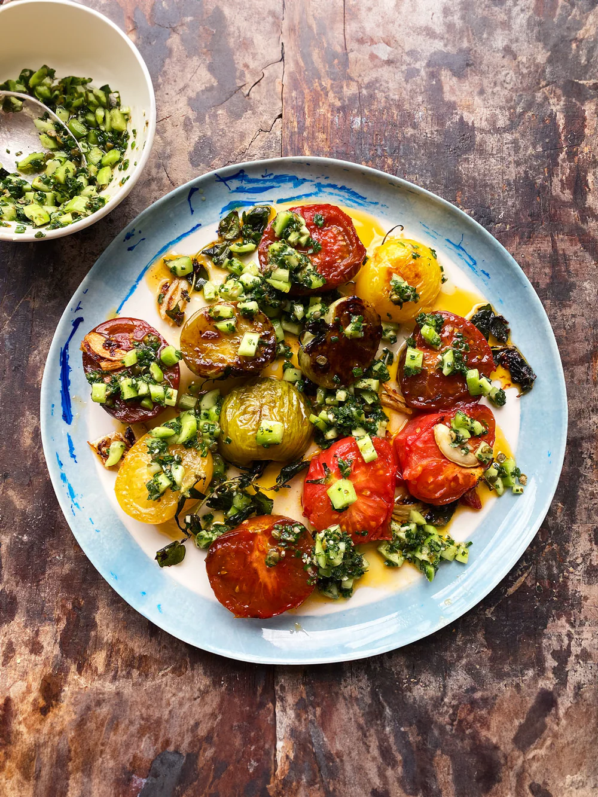

---
image: ../pics/fried-tomatoes-cucumber-salsa.webp
---
# Жареные помидоры с огуречной сальсой

#### Ингредиенты
на 4 порции

* оливковое масло 4 ст л
* мёд 1 ст л
* разноцветные помидоры, 6 шт
* орегано
* чеснок 4 зубчика

**для сальсы:**
* огурец 120 г
* заатар
* сухой чеснок
* каперсы 1 ст л
* яблочный уксус 1 ст л
* оливковое масло 3 ст л
* соль, черный перец

#### Приготовление

Помидоры разрезать пополам. Добавить масло и кленовый сироп в среднюю сковороду и поставить ее на средний огонь. Посыпать разрез помидоров солью и молотым перцем. Когда сковорода нагреется, добавить помидоры, срезанной стороной вниз, и посыпать другую сторону солью и молотым перцем. Жарить 10-12 минут, пока они не начнут подрумяниваться снизу, затем аккуратно перевернуть и жарить еще 4-5 минут. Добавить веточки орегано и раздавленный чеснок и жарить еще 2 минуты, пока помидоры не размягчатся и слегка не карамелизируются, а чеснок не подрумянится. Некоторые помидоры размягчатся быстрее, чем другие; аккуратно вынуть их, когда они будут готовы, и разложить на сервировочной тарелке. Когда все помидоры будут готовы, выложить их на тарелку и полить жареным чесноком, орегано и любой жидкостью из сковороды.

Тем временем смешайте все ингредиенты для огуречной сальсы и приправить солью и молотым перцем. Выложите половину этой смеси на помидоры, подавая оставшуюся часть рядом.

*Yotam Ottolenghi, "Jerusalem"*
