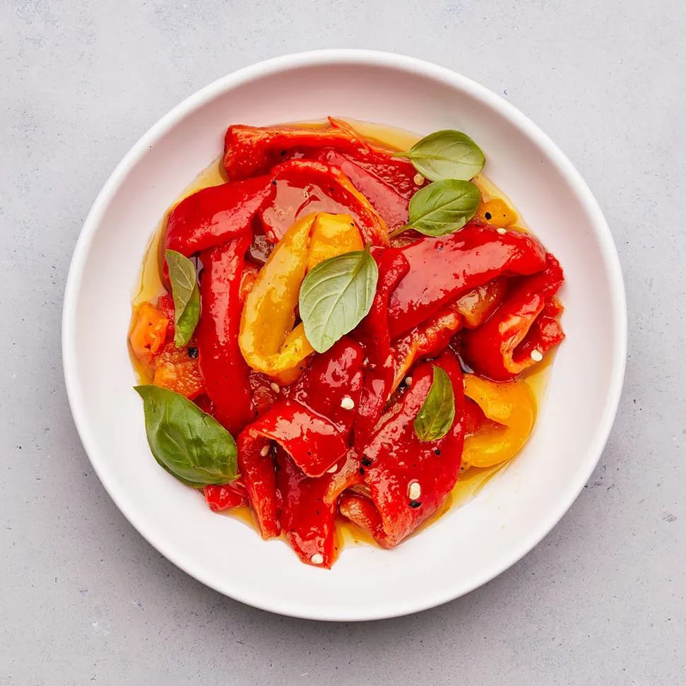

---
image: ../pics/peppers-marinated.webp
---
# Маринованные перцы

#### Ингредиенты

* болгарский перец
* базилик
* чеснок
* оливковое масло
* винный уксус
* соль

#### Приготовление

Разогреть гриль, обжарить перцы на противне с решеткой, переворачивая щипцами каждые 5 минут, пока все стороны не обуглятся. Остудить, очистить перцы, мякоть разделить на полоски. В миску с перцами добавить веточки базилика, чеснок, масло, соль, уксус и любые соки с противня, перемешать. 

Накрыть и настоять 1 час. Охладить на ночь или хранить в холодильнике до 3 дней.

Для подачи довести до комнатной температуры, подавать украсив листиками базилика.

*bonappetit.com*
