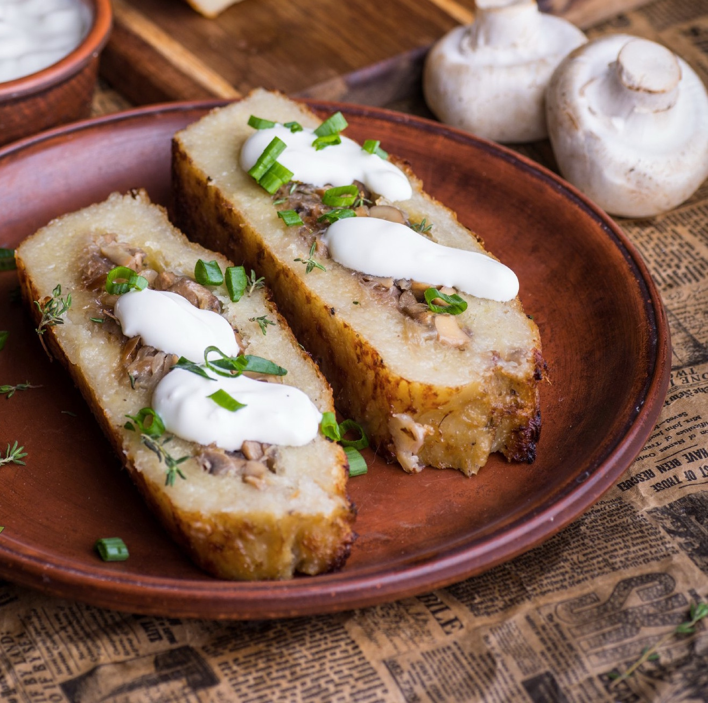

---
image: ../pics/potato-mushroom-casserole.jpg
---
# Картофельная запеканка с грибами

#### Ингредиенты

* картофель 1кг
* мука 1 ст л
* грибы 600 г
* сметана по вкусу
* сливочное масло 30 г
* тимьян 2-3 веточки
* соль, черный перец по вкусу
* *бекон или грудинка опционально*

#### Приготовление

Грибы вымыть, промокнуть влагу, нарезать кубиками. Обжарить грибы с ложкой растительного масла на среднем огне. Как испарится влага от грибов, огонь снизить, добавить сливочное масло и жарить дальше, помешивая, до красивого, золотистого цвета. В конце добавить соль, перец и свежий тимян.

Разогреть духовку на 200С.

Картофель очистить и натереть на терку. После половины добавить сметану, чтобы остановить процесс окисления. Дотереть картошку, перемешать.

Форму для запекания смазать сливочным маслом, выложить в форму половину картофеля. Осторожно выложить грибы, стараясь не залезать по бокам, накрыть все второй половиной картофеля. Все разровнять с помощью лопатки или ложки.

Запекать при 200С где-то 50 минут до красивой корочки. Для экстра хрустящей корочки на последнем этапе, запеканку можно смазывать кусочком сливочного масла. Вынуть и остудить. Подавать со сметаной.

_tg: OdessaCarrot_
