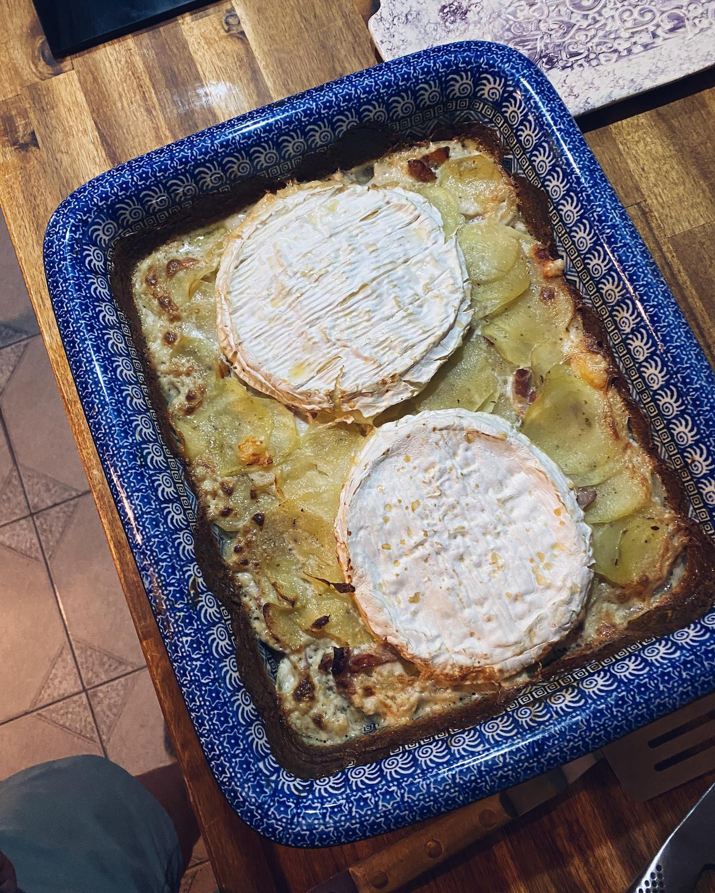

---
image: ../pics/tartiflette.jpg
---
# Тартифлетт

#### Ингредиенты

* картофель 6-8 шт
* бекон 250 г
* чеснок 3 зубчика
* белое вино 120 мл
* сливки 200 мл
* сыр Реблушон или Бри 1 шарик
* соль, перец, щепотка мускатного ореха, щепотка прованских трав

#### Приготовление

С помощью овощерезки нарезать картофель тонкими ломтиками, сложить в миску, посолить, добавить мускатный орех, специи и чёрный перец.

Бекон нарезать соломкой и на голой сковороде обжарить до мягкости не засушивая. Остывший бекон переложить к картофелю, перемешать.

Ровным слоем выложить запеканку в форму с толстым дном. Налить сливки и добавить вина по желанию, они не должны покрывать полностью запеканку. Разрезать сыр вдоль на две части и уложить срезом вниз на картофель. 

Разогреть духовку до 160С, конвекция. Накрыть фольгой и убрать на час в духовку. Снять фольгу и запекать еще минут 10 до корочки.

*ig:dailyrecipes_kris*
