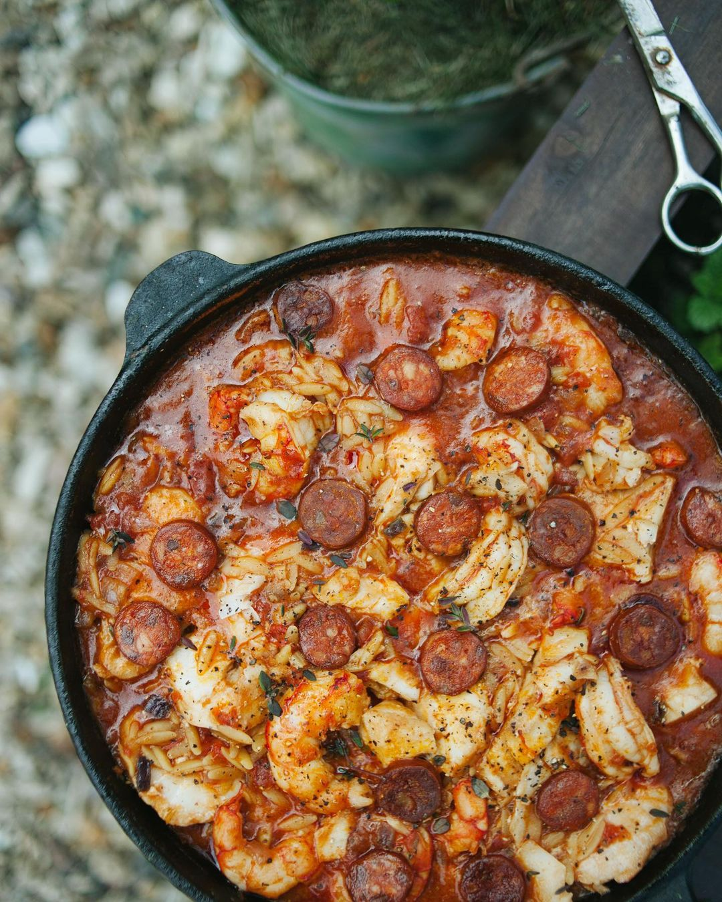

# Орзо с креветками и чоризо

**Ингредиенты:**

* Чоризо \(опционально\)  - 100 г 
* Креветки \(или мидии\) - 300 г 
* Белая рыба \(или курица\) - 300 г 
* Лук репчатый - 1 средняя шт 
* Чеснок - 2 зубчика 
* Томаты очищенные, нарезанные - 200 г 
* Белое сухое вино - 50 мл 
* Растительное масло - 2 ст л 
* Рыбный или овощной бульон \(или обычная вода\) - 300 мл 
* Копченая паприка
* Соль и перец по вкусу

#### Приготовление:

Лук нарезать мелким кубиком. Чоризо нарезать тонкими колечками. Чеснок очистить от шелухи, раздавить ножом. Нагреть сковороду и выложить туда колбасу, без добавления масла. Затем выложить лук и чеснок, обжарить. Добавить немного копченой паприки для цвета и аромата. 

Влить вино, дать алкоголю выпариться, затем добавить томаты, посолить и поперчить. Добавить орзо, воду и перемешать. 

Готовить под крышкой на среднем огне 10 минут. 

Креветки очистить от панциря, удалить вену,надрезав ее по спинке. Рыбу нарезать небольшими кусочками. Рыбу и креветки положить в сковородку к орзо, накрыть крышкой и готовить еще 10 минут. Затем крышку снять, огонь прибавить и дать воде полностью выпариться

\_\_[_https://www.instagram.com/p/COFRPWtH\_K-/_](https://www.instagram.com/p/COFRPWtH_K-/)\_\_

