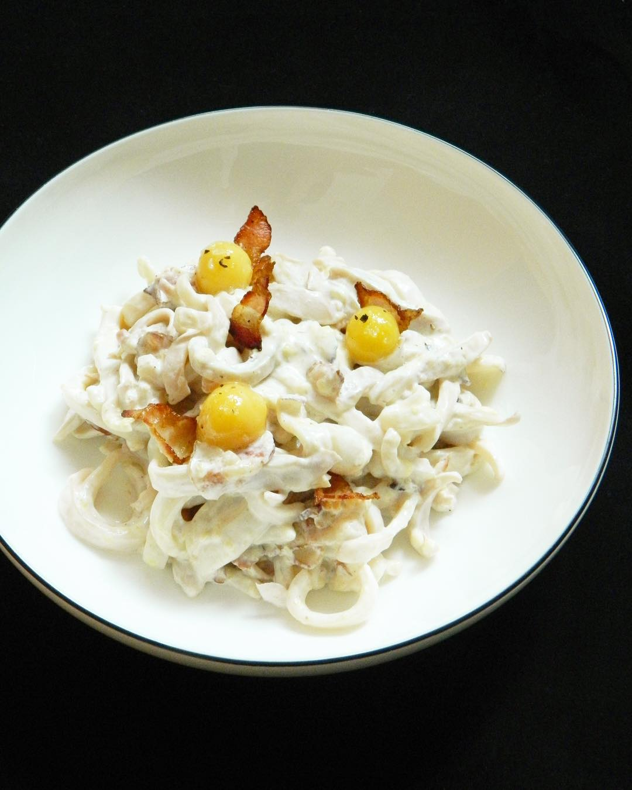

# Паста карбонара с кальмарами

#### Ингредиенты :

* Кальмары
* Бекон
* Сливки 20%
* Чеснок
* Пармезан
* Яичный желток
* Паста

#### Приготовление:

Кальмары очистить с двух сторон от плёнок \(самое важное в мягкости кальмаров\). Нарезать на полоски. Бекон нарезать. Обжарить без масла, удалить жир. Залить сливками, добавить чеснок, немного уварить. Чеснок удалить. Кальмары обжарить \(2-3 минуты\), хотя можно и отварить. Готовые кальмары добавить в соус. Быстро прогреть. Добавить пармезан. При подаче добавить желток.

\_\_[_https://www.instagram.com/foodedlife/_](https://www.instagram.com/foodedlife/)\_\_

