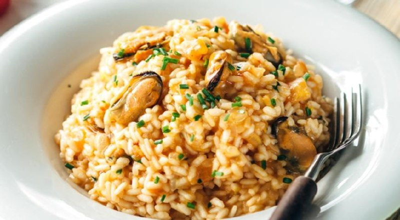

# Томатное ризотто с мидиями

## Ингридиенты:

* 2 банки \(150 г\) мидий в масле с пряностями "Золотистые"«Меридиан»
* 125 г риса арборио
* 1 маленькая луковица
* 2 больших помидора
* 10 помидоров черри, желательно на веточках
* 1 зубчик чеснока
* 500 мл рыбного бульона
* 150 мл сухого белого вина
* оливковое масло
* 1 ч. л. сушеного орегано
* соль
* свежемолотый черный перец

## Приготовление:

Очистить и порезать лук очень мелкими кубиками, томаты положить в миску и залить кипятком на 3 мин, обдать холодной водой и очистите от кожицы, нарежьте кубиками.

Поставить на огонь кастрюлю с бульоном, довести до кипения и убавить огонь до минимального.  
Разогреть сковороду с оливковым маслом, положить раздавленный зубчик чеснока и жарить 1 мин, добавить томаты с орегано и пассировать на медленном огне, помешивая в течении 7 мин.

В другой сковороде с высокими бортиками или широком сотейнике разогреть оливковое масло и обжарить лук на среднем огне, помешивая, до мягкости, 4-5 мин, затем добавить рис и обжарить, постоянно помешивая в течении 5 мин. Влить в сковороду вино и готовить, помешивая, пока вино не выпарится. Уменьшить огонь до чуть ниже среднего, добавить половник горячего бульона и постоянно помешивать, пока бульон не выпарится, только тогда влить следующий половник бульона. Варить ризотто 10 мин., мешая и подливая бульон, бульона может понадобиться чуть больше или меньше.Добавить к рису обжаренные томаты, перемешайть и готовить 5 мин.

Попробовать рис, если он снаружи мягкий, а внутри еще твердый, то влить последний половник бульона, посолить и поперчить. Добавить в ризотто мидии, оставив несколько штук для подачи. Снять с огня. На этом этапе ризотто должно быть чуть жиже, чем надо. Накрыть сковороду крышкой и оставить на 10 мин.

Для подачи запечь в духовке помидоры черри на ветке, полив оливковым маслом. Разложить ризотто по тарелкам, украсить оставшимися мидиями и помидорами черри.

[_https://t.me/ktchn\_story_](https://t.me/ktchn_story)\_\_

