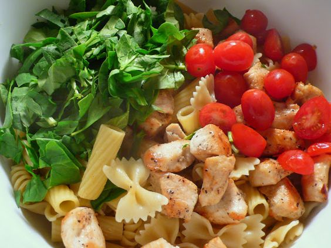

---
image: ../../pics/baked-pasta-chicken.jpg
---
# Запеченная паста с курицей и шпинатом

#### Ингредиенты
на 6-8 порций

* смесь макарон 300 г
* сливочное масло 30 г
* сливочный сыр 100 г
* сметана или греческий йогурт 200 г
* молоко 200 г
* пармезан 90 г
* моцарелла 150 г
* соль, перец, хлопья красного перца, чесночный порошок
* свежий шпинат 200 г
* куриная грудка 500 г
* помидоры черри 80 г
* свежий базилик или петрушка

#### Приготовление

Разогреть духовку до 180 градусов. 

Приготовить макароны в подсоленной, кипящей воде al dente, слить воду. Отварить курицу, нарезать кубиком.

В кастрюлю положить сливочный сыр и готовить помешивая, пока он не расплавится. Уменьшить огонь до минимума, добавить сметану, сливки, тертый пармезан, половину тертой моцареллы, соль, чеснок, черный и красный перец. Готовить помешивая, пока сыр не расплавится. Снять с огня.

Смешать макароны, курицу, шпинат и помидоры в большой миске, добавить соус и осторожно перемешать.

Вылить в подготовленную форму для выпечки. Посыпать оставшейся тертой моцареллой. Запекать 20 -25 минут или пока запеканка не подрумянится. Чтобы паста не пересохла можно поставить в духовку кастрюльку с водой, которая будет испаряться пока готовится паста.

Перед подачей украсить базиликом или петрушкой.  

*joyouslydomestic.com*
