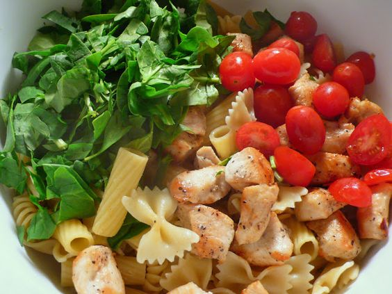

# Запеченная паста с курицей и шпинатом

#### Ингредиенты
на 6-8 порций

* смесь макарон 300 г
* сливочное масло 30 г
* рикотта 100 г
* сметана или греческий йогурт 200 г
* сливки 10% 200 г
* кукурузный крахмал 1 ч л
* вода от варки пасты 
* соль, перец, хлопья красного перца, чесночный порошок
* пармезан 20 г
* моцарелла 100 г
* свежий шпинат 200 г
* куриная грудка 500 г
* помидоры черри 100 г
* свежий базилик или петрушка

#### Приготовление

Разогреть духовку до 180 градусов. 

Приготовить макароны в подсоленной, кипящей воде al dente, слить воду, оставить пару половников. Отварить курицу, нарезать кубиком.

В кастрюлю положить сливки, кукурузный крахмал, прогреть, довести до кипения и легкого загустения. Уменьшить огонь до минимума, добавить рикотту, сметану, соль и специи. Если соус слишком жидкий, добавить немного воды от пасты и прогреть. Снять с огня.

Смешать макароны, курицу, шпинат и помидоры в большой миске, добавить соус и тертые сыры моцарелла и пармезан и осторожно перемешать.

Вылить в подготовленную форму для выпечки. Посыпать оставшейся тертой моцареллой. Запекать 20 -25 минут или пока запеканка не подрумянится. Чтобы паста не пересохла можно поставить в духовку кастрюльку с водой, которая будет испаряться пока готовится паста.

Перед подачей украсить базиликом или петрушкой.  

*joyouslydomestic.com*
