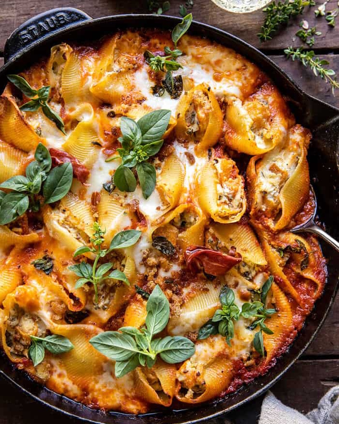

# Ракушки из макарон с начинкой из тыквы и сыра

#### Ингредиенты

* 1 столовая ложка оливкового масла
* 280 г мускатной тыквы
* 2 столовые ложки свежих листьев тимьяна
* 1 щепотка хлопьев красного перца
* 85 г прошутто
* 450 г пасты большие ракушки
* 370 г сыра рикотта
* 260 г фонтина или другого средне-твердого сыра
* 980 г соуса [Маринара](https://mars9n9.github.io/%D0%A1%D0%BE%D1%83%D1%81%D1%8B/marinara.html)
* 225 моцареллы
* свежий базилик
* соль, перец

#### Приготовление  

Разогреть духовку до 220 °C. На противень  выложить тыкву, приправить маслом, тимьяном, хлопьями красного перца, перцем и сольюс. Выложить прошутто поверх тыквы. Запекать 15-25 минут пока прошутто не станет хрустящим. Затем вынуть прошутто и продолжить запекать тыкву до мягкости.  
Тем временем отварить макароны al dente, обсушить.  
В средней миске смешать рикотту, фонтину и запеченную тыкву.  
Выложить немного томатного соуса на дно формы для запекания, каждую ракушку начинить 1 столовой ложкой сыра и выложить в форму. Сверху полить оставшимся соусом и посыпать моцареллой. Выпекать 20-25 минут или пока сыр не расплавится и не подрумянится сверху.  
Подавать с прошутто и базиликом.

*halfbakedharvest.com*
