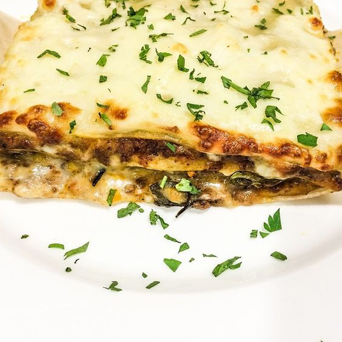

---
image: ../../pics/02dce25fb70bef390ccad3e126c2999b.jpg
---
# Лазанья

#### Ингредиенты

* 500 мл соуса [бешамель](https://mars9n9.github.io/%D0%A1%D0%BE%D1%83%D1%81%D1%8B/besciamella.html)
* 1 л мясного рагу \([соус болоньезе](https://mars9n9.github.io/%D0%A1%D0%BE%D1%83%D1%81%D1%8B/sous_boloneze.html)\)
* 250 г сыра моцарелла
* листы лазаньи

#### Приготовление

Разогреть духовку до 190°С.  
Моцареллу достать из рассола, отожать руками и нарезать небольшими кусочками.  
Рагу тщательно перемешать с соусом бешамель и распределить небольшую часть смеси по дну формы. Сверху выложить в один слой листы лазаньи, смазать их соусом и распределить сверху кусочки моцареллы. Накрыть листами лазаньи и повторить процесс так, чтобы верхний слой получился из моцареллы.  
Несколько раз наколоть тесто вилкой. Накрыть лазанью фольгой, чтобы она не пригорала, и поставить в предварительно разогретую духовку. На приготовление лазаньи обычно уходит около 50 минут. За 15 минут до готовности снять с нее фольгу и увеличить температуру духовки до 220°С.  
Готовую лазанью остудить, нарезать на порционные куски, украсить зеленью, разложить по тарелкам и сразу подавать.

*ellamartino.ru*

