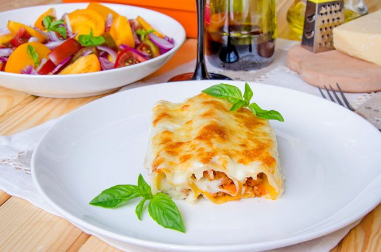

---
image: ../../pics/1892-c058f5.jpg
---
# Каннеллони с болоньезе из печени

#### Ингредиенты

* говяжья печень 500 грамм
* каннеллони
* лук
* чеснок 1 зубчик
* черешок сельдерея
* белое вино 1 ст
* молоко 800 мл
* соль
* перец
* итальянские травы
* грибы
* соус [бешамель](https://mars9n9.github.io/%D0%A1%D0%BE%D1%83%D1%81%D1%8B/besciamella.html)
* моцарелла

#### Приготовление

Провернуть печень через крупную сетку мясорубки, предварительно изъяв все жилки. Лук, чеснок и сельдерей нарезать мелкими кубиками и обжарить в оливковом масле до мягкости. Добавить на сковороду фарш и, помешивая и разбивая комочки, дать ему схватиться и слегка обжариться вместе с овощами. Влить вино и, не забывая активно мешать, дать вину выпариться. После добавить молоко, соль, перец, щепотку сухих итальянских трав и тушить на небольшом огне, пока не загустеет.

Начинить этим соусом каннеллони, сверху выложить обжаренные грибы, полить соусом бешамель. Отправить в разогретую до 180 градусов духовку на 30 минут, потом присыпать сыром и запекать до корочки. Готовое блюдо посыпать зеленью

*Игорь Шурупов, шеф-повар ресторана Accenti*
