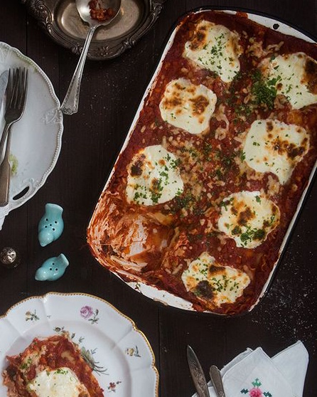

# Сырная лазанья

#### Ингредиенты

* 700г сыра рикотта
* 2 чашки тертой моцареллы
* 1/2 чашки тертого Пармезана
* 1/3 чашки петрушки
* 1 большое яйцо
* соль и перец для вкуса
* 15 сухих листов лазаньи
* 2 порции соуса [Маринара](https://mars9n9.github.io/%D0%A1%D0%BE%D1%83%D1%81%D1%8B/marinara.html)
* 8 ломтиков свежей моцареллы

#### Приготовление

Приготовить соус.

Разогреть духовку до 190С. В миске смешать рикотту, 1 чашку тертой моцареллы, пармезан, петрушку, яйцо, соль и перец. Хорошо перемешать до однородности.

Выложить половник соуса маринара в форму для выпечки, выложить слой листов лазаньи. Выложить половину смеси из рикотты и пол чашки тертой моцареллы. Выложить сверху листы лазаньи, слой соуса, 1/2 чашки тертой моцареллы и 8 ломтиков свежей моцареллы. Накрыть фольгой и запекать 45 минут. Дать остыть 15 минут перед подачей на стол. Перед подачей посыпать нарезанной зеленью.

*deliciousshots.blogspot.ru*
