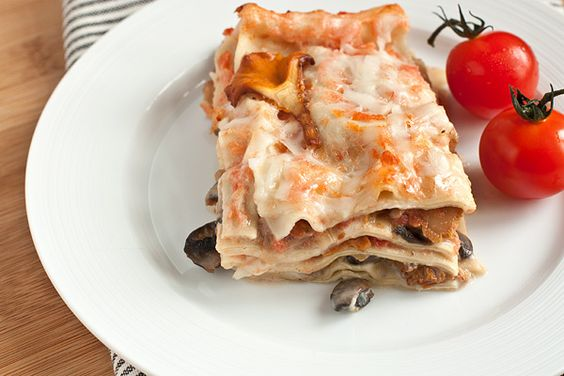

---
image: ../../pics/lasagna-mushroom.jpg
---
# Лазанья с грибами

#### Ингредиенты

* сливочное масло 3 ст л
* оливковое масло 3 ст л
* лисички 500 г
* шампиньоны 300 г
* белое сухое вино 50 мл
* буррата или моцарелла 250 г
* пассата 250 г
* орегано 1 ч.л
* базилик сушеный 1 ч.л
* листья майорана
* лазанья \(листы\) 12 шт.
* твердый сыр \(Пармезан, Грюйер, Пекорино\) 150 г
* соус [бешамель](https://mars9n9.github.io/%D0%A1%D0%BE%D1%83%D1%81%D1%8B/besciamella.html) 500 мл

_Лазанью с грибами можно делать не только в грибной сезон. Для нее хорошо подойдут разные сочетания грибов, например, сушеные белые грибы \(предварительно размочить\), опята и доступные круглый год шампиньоны и вешенки. Если использовать сушеные белые грибы, то воду после замачивания можно использовать для замены части молока в бешамель._

#### Приготовление

Свежие грибы тщательно очистить от земли, вымыть и обсушить.

Обжарить половину грибов в смеси сливочного и оливкового масла около 10 минут, пока грибы не подрумянятся. Отложить. Обжарить вторую половину грибов. Вернуть все грибы в сковороду, добавить мелко нарезанный лук и вино. Готовить помешивая 5 минут.

Приготовить соус бешамель.  
Добавить ароматные травы к пассате, прогреть.  
Соединить грибы, бешамель и пассату.

Собрать лазанью: Выложить слой соуса на дно формы. Выложить слой листов для лазаньи,  смазать их соусом и распределить сверху кусочки моцареллы. Посыпать пармезаном и листьями майорана. Накрыть листами и повторить слои в том же порядке еще три раза, последним должен быть слой пармезана, посыпать черным перцем.  
Верх лазаньи можно украсить разрезанными вдоль на 3-4 пластинки грибами.  
Несколько раз наколоть тесто вилкой, накрыть лазанью фольгой. Запекать в разогретой до 190 градусов духовке 20 минут, затем снять фольгу и запекать еще 15 минут.

*bonappetit.com*
