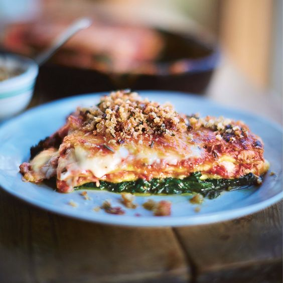

# Лазанья с хрустящей уткой

#### Ингредиенты

8-19 порций \| 4 часа

* 1 целая утка \(примерно 2 кг\)
* оливковое масло
* 4 зубчика чеснока
* 1 пучок свежего майорана \(30г\)
* 800г свежего шпината
* 1 целый мускатный орех
* 1 луковица
* 2 моркови
* 2 палочки сельдерея
* 200мл белого вина
* 4 х 400г банки томатов
* 2 свежих листьев лавра
* 2 гвоздики
* 400г свежих листов лазаньи
* 40г Пармезана

**для белого соуса:**

* 1 л соуса [бешамель](https://mars9n9.github.io/%D0%A1%D0%BE%D1%83%D1%81%D1%8B/besciamella.html)
* 75г Чеддера
* 75г твердого сыра \(Фонтина или Taleggio\)

**для панировки:**

* 200г черствого хлеба
* 4 веточки свежего розмарина

#### Приготовление

Разогреть духовку до 180C. Обмазать утку маслом, солью и черным перцем. Запекать до хрустящей корочки около 2 часов, остудить, удалить жир, обрезать мясо и отложить.

Очистить и мелко нарезать 2 зубчика чеснока, а обжарить на сильном огне с небольшим количеством утиного жира и майораном. Готовить до золотистого цвета чеснока, добавить шпинат и тертый мускатный орех и готовить 15 минут, пока избыток воды не испарится.

Приготовить рагу. Лук, морковь и сельдерей крупно нарезать. Обжарить в глубокой кастрюле на утином жире и раздавленным оставшимся чесноком. Готовить 20 минут, пока овощи не карамелизуются. Добавить вино и выпарить его на сильном огне. Добавить мелко нарезанное утиное мясо, консервированные помидоры, залить 1 л воды, добавить лавровый лист и гвоздику. Готовить на медленном огне около часа.

Приготовить бешамель. Убрать с огня, добавить тертый сыр.

Выложить слой шпината в форму, покрыть слоем листов лазаньи. Смешать рагу с тертым пармезаном, выложить слой рагу на листы лазаньи. Повторить слои еще 2 раза. Закончить слоем белого соуса, хорошо посыпать пармезаном. Накрыть форму фольгой и запекать при температуре 180C 40 минут до золотистого цвета. Оставить примерно на 20 минут перед подачей

Смешать хлеб и листья розмарина в кухонном комбайне с кожей утки и жиром и порубить на мелкие крошки. Обжарить до золотистого цвета, перед подачей посыпать лазанью.

*womanandhome.com*