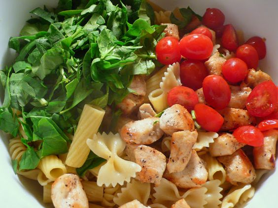

---
image: ../../pics/9e791f603736d00755d87af4d013f0d7.jpg
---
# Запеченная паста с курицей и шпинатом

#### Ингредиенты
на 6-8 порций

* 300 г смеси макарон
* 2 столовые ложки сливочного масла
* 1/2 луковицы
* 2 зубчика чеснока
* 100 г сливочного сыра
* 1 чашка сметаны или греческого йогурта
* 1 чашка сливок 15% или молока
* 1/2 чашки тертого пармезана
* 2 стакана тертой моцареллы
* 1/2 чайной ложки соли
* 1/2 чайной ложки черного перца
* Хлопья красного перца
* 1 - 1 1/2 чашки свежего шпината
* 2 чашки вареной курицы
* 1/2 чашки помидоров черри
* Свежий базилик или петрушка

#### Приготовление

Разогреть духовку до 180 градусов.  
Приготовить макароны в подсоленной, кипящей воде al dente, слить воду.  
Пока макароны варятся, разогреть масло в сковороде на среднем огне, добавить лук и чеснок, обжарить 3-4 минуты. Добавить сливочный сыр и готовить помешивая, пока он не расплавится. Уменьшить огонь до минимума, добавить сметану, сливки, тертый пармезан, 1 чашку тертой моцареллы, соль, черный и красный перец. Готовить помешивая, пока сыр не расплавится. Снять с огня.  
Смешать макароны, курицу, шпинат и помидоры в большой миске, добавить в соус и осторожно перемешать. Вылить в подготовленную форму для выпечки. Посыпать оставшейся тертой моцареллой.  
Запекать 20 -25 минут или пока запеканка не подрумянится. Чтобы паста не пересохла можно поставить в духовку кастрюльку с водой, которая будет испаряться пока готовится паста.  
Перед подачей украсить базиликом или петрушкой.  

*joyouslydomestic.com*
