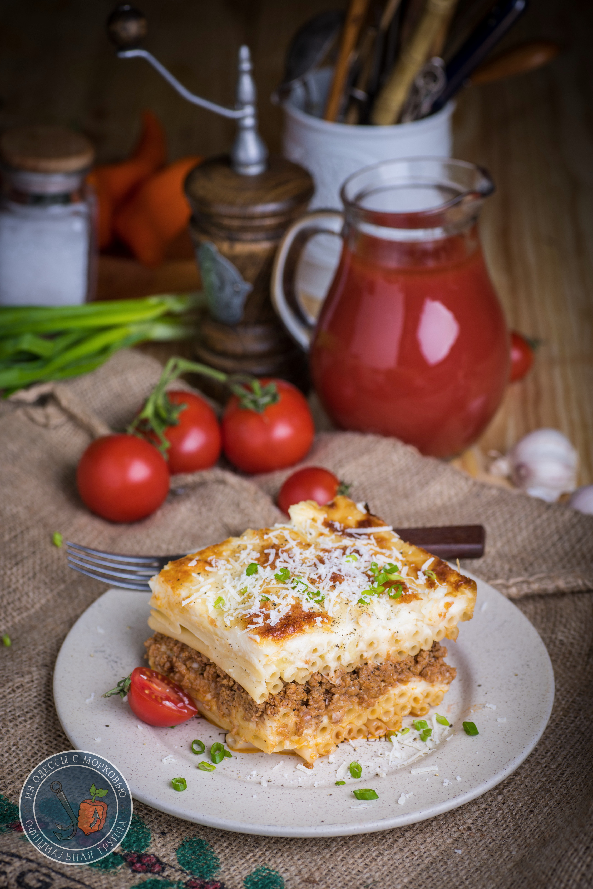

# Пастицио \| Παστίτσιο

#### Ингредиенты

* Букатини, макароны, пенне – 500г
* Сыр \(смесь твердого, моцареллы и пармезана\) - 400 г
* 1 л соуса [бешамель](https://mars9n9.github.io/%D0%A1%D0%BE%D1%83%D1%81%D1%8B/besciamella.html)

**для мясного соуса:**

* фарш говяжий или  смесь из говяжьего и свиного - 700г.
* томатная паста - 70-80г
* 2 небольших луковицы или одна крупная
* чеснок - 3-4 зуба
* корица – 1 палочка или 2ч.л. молотой.
* черный перец - пара-тройка щепоток

#### Приготовление

Лук нарезать мелким кубиком, чеснок измельчить. В сковороде разогреть пару ложек масла, луки чеснок готовить на небольшом огне до легкого, подрумяненного цвета. Добавить фарш и готовить, разбивая его лопаткой на мелкие части. Как только весь фарш поменяет цвет и побелеет, накрыть крышкой и готовить 10-15 минут на небольшом огне. Если фарш обильно дал воду и она не выпарилась, готовить без крышки еще немного, пока вода не исчезнет. Добавить корицу, соль и перец. Перемешать и готовить пару минут Добавить томатную пасту и тщательно перемешать. Добавить пару щепоток сахара. Фарш снять с огня и дать немного остыть.

Разогреть духовку до 180С.  
Сварить пасту al dente.  
Приготовить соус бешамель.

Подготовить форму для запекания - смазать сливочным или растительным маслом: дно и стенки. Выложить 2\3 макарон, мелко нарезать небольшой кусочек сливочного масла и выложить сверху. Сверху натереть немного твердого сыра и равномерно распределить 1 половник соуса. Выложить фарш, сверху выложить твердый сыр и почти всю моцареллу. Сверху распределить оставшиеся макароны, вылить весь оставшийся бешамель и аккуратно его выровнять, покрошить оставшуюся моцареллу и пармезан.

Отправить в духовку на 45-55 минут. Остудить перед подачей.

*Tg:OdessaCarrot*
