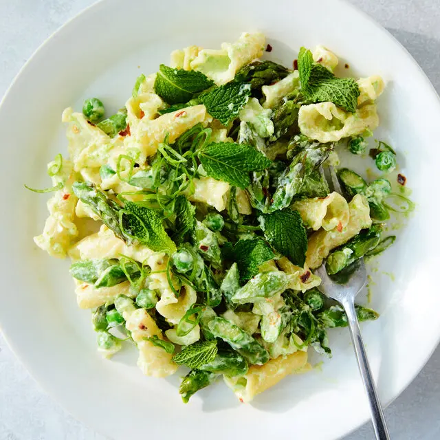

---
image: ../../pics/asparagus-pasta.webp
---
# Весенняя паста со спаржей

#### Ингредиенты
на 2 порции

* сливочное масло 20 г
* кримчиз или фета 100 г
* спаржа, зеленый горошек, зеленая фасоль и другая зелень
* паста спагетти или фетучини
* чеснок 2 зубчика
* пармезан 10 г
* хлопья красного перца, черный перец, соль

#### Приготовление

Пасту отварить al dente, воду сохранить. Паста должна только закончить готовиться, когда соус будет готов.

Мелко нарезать чеснок. Спаржу и другие овощи бланшировать в кипятке, остудить и нарезать на небольшие кусочки.

Растопить сливочное масло в сковороде на среднем огне, обжарить овощи и зелень, добавить чеснок и приправы, обжарить еще немного.

Смешать оба сыра, добавить к зелени, добавить немного воды от пасты.
Используя щипцы, переложить пасту прямо из кастрюли в сковороду, перемешать, прогреть до кремовости и загустения.

*tiktok: nytcooking*
