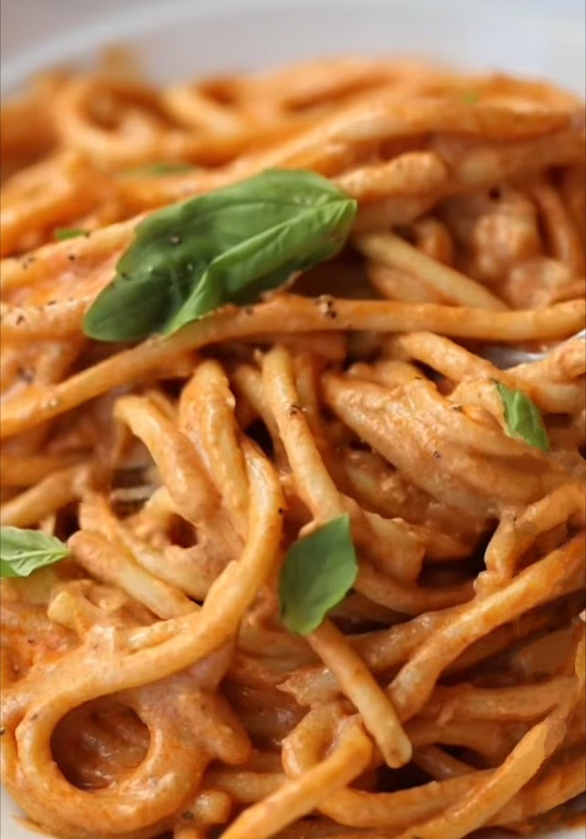

---
image: ../../pics/Screenshot_20240728-003931~2.jpg
---
# Творожная паста

#### Ингредиенты
на 4 порции

* 450 г букатини
* 45 г масла
* 4 зубчика чеснока
* 1/4 ч. л. хлопьев чили
* 90 г томатной пасты
* 240 мл куриного бульона
* 15 г свежего базилика + несколько небольших листьев для подачи
* 90 г вяленых томатов
* 300 г жирного творога комнатной температуры
* 40 г свеженатертого пармезана
* Соль и перец по вкусу

#### Приготовление

Пасту отварить al dente, воду сохранить. Паста должна только закончить готовиться, когда соус будет готов.
Мелко нарезать чеснок. Растопить масло в сотейнике на среднем огне. После того, как оно расплавится, добавить чеснок и хлопья чили и обжарить 30 секунд, затем добавить томатное пюре и обжаривать в течение примерно минуты. Влить бульон и перемешать. Выключить огонь и оставить остывать около минуты.  
Вылить соус в блендер, затем добавить базилик, вяленые помидоры и творог, взбить в блендере. При необходимости добавить немного воды от пасты.  
Используя щипцы, переложить пасту прямо из кастрюли в сковороду, залить соусом, помешать, добавить пармезан. Подождать загустения, оставшегося тепла от пасты будет достаточно, чтобы хорошо загустить соус.  
Подавать украсив листьями базилика.

*Tiktok: Chris Collins*
