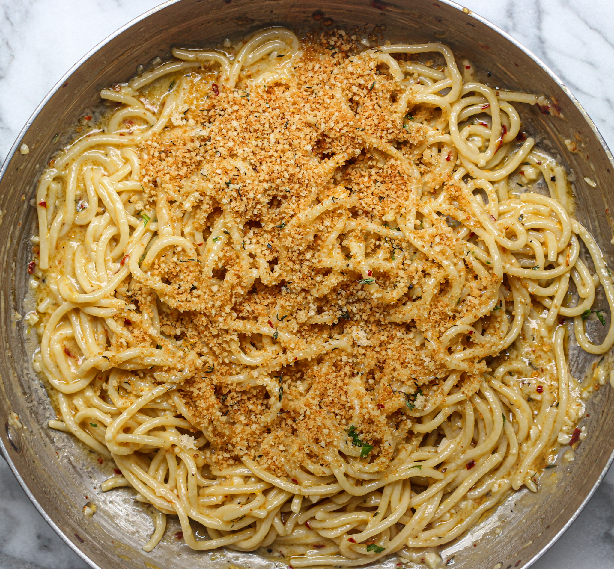

---
image: ../../pics/creamy-lemon-pasta.jpg
---
# Сливочная лимонная паста с хрустящими крошками

#### Ингредиенты

* Чеснок 2-3 зубчика
* Молотая паприка 1 ч л
* Оливковое масло 2 ст л
* Сливочное масло 40 г
* Пармезан 30 г
* Свежий тимьян 1 ст л
* Спагетти 150 г
* Соль и черный перец по вкусу
* Сок и цедра 1 среднего лимона
* Сухари панко 60 г
* Консервированный артишок

#### Приготовление

Приготовить хрустящие хлебные крошки, разогреть 10 г сливочного масла на среднем огне, добавить панировочные сухари и тимьян, обжарить, часто помешивая, пока крошки не станут золотистыми.

Отварить пасту al dente. Разогреть оливковое, добавить чеснок, паприку, тимьян и помешивать. Добавить черный перец и сливочное масло. Добавить 1/2 стакана воды от пасты, сыр, лимонный сок, лимонную цедру и перемешать. Добавить пасту и довести до готовности, добавить пармезан.

Подавать, посыпав хрустящими панировочными сухарями, украсив артишоком.

*tiktok: figandoliveplatter*