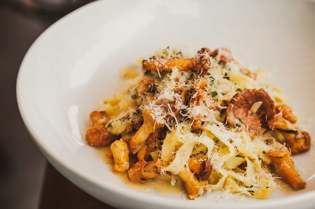

# Феттуччини с лисичками и эстрагоном

#### Ингредиенты

* 90 г паста
* 100 г лисички
* 30 г лук красный
* 1 зубчик чеснока
* 2 ветки эстрагона
* 40 мл масло оливковое
* 30 г масло сливочное
* 60 мл белое вино
* 45 г сыр пармезан или грана падано
* Соль и перец

#### Приготовление

На раскаленной сковороде на оливковом масле обжарить грибы с чесноком и луком, добавить вино и выпарить его на 80 %. Затем добавить рубленый эстрагон, масло, соль и перец. Пасту отварить al dente. Добавить пасту в грибной соус, хорошо перемешать. Подавать с тертым сыром.

*от Ивана Ермилова, шеф-повара Prosecco Bar*
