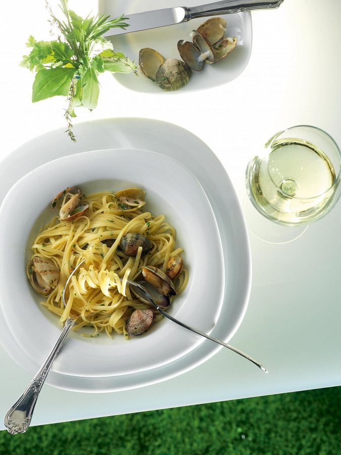

# Лингвини с вонголе \| Linguine alle vongole

#### Ингредиенты

* 300 г пасты лингвини
* 1 кг свежих моллюсков
* 2 дольки чеснока
* 1 ст. белого вина
* острый перец \(по желанию\)
* пассата
* оливковое масло
* петрушка
* соль

#### Приготовление

Промыть вонголе. В большую миску набрать холодной воды и положить крупную соль \(1-2 ст.л.\). Выложить в воду вонголе и оставить минут на 30-40. Воду время от времени менять. По истечение указанного времени ракушки как следует окончательно промыть в проточной воде и скинуть на дуршлаг. Проследить, чтобы все ракушки были плотно закрыты.

Отварить пасту, согласно указаниям на упаковке.

Чеснок очистить и, при желании, разрезать вдоль, острый перец нарезать кольцами. На сковороде разогреть оливковое масло. В горячее масло положить чеснок и острый перец и дать немного подрумяниться.

Выложить на сковороду моллюсков. Потряхивая сковороду, дать им обжариться в подготовленном масле буквально 1 минуту. Затем добавить стакан белого вина и накрыть сковороду крышкой.

В течение нескольких минут все ракушки-вонголе откроются. Открыть крышку и на сильном огне дать соусу увариться на одну треть. В этот момент добавить пассату

Добавить мелко порезанную петрушку. Перемешать. Выложить к ракушкам пасту.

*edimdoma*
