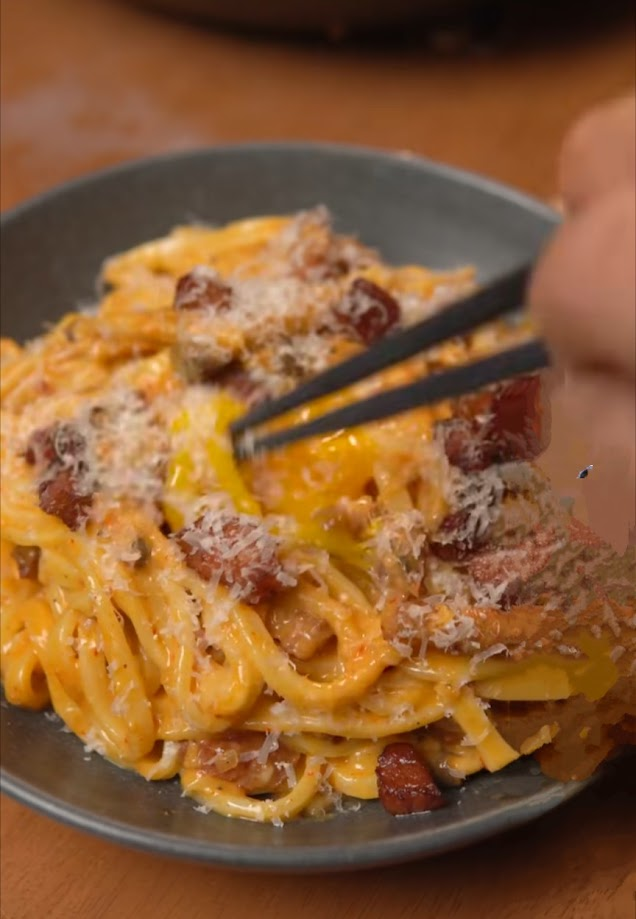

# Острая мисо карбонара

#### Ингредиенты

* 140 г бекона
* лука-шалот
* 2 зубчика чеснока
* 140 г грибов шимеджи
* 340 г лапши удон
  
**для соуса:**

* 1 яйцо
* 2 яичных желтка
* 2 ст. л. пасты мисо
* 2 ст. л. пасты кочудян
* 2 ч. л. хлопьев чили
* 1 ч. л. черного перца
* тертый пармезан

#### Приготовление

Подготовить и нарезать лук-шалот, чеснок, грибы шимеджи и бекон.  
Смешать ингредиенты для соуса в миске.  

В холодной сковороде на среднем огне обжарить бекон до хрустящей корочки (5-6 минут). Вынуть бекон и обжарить лук-шалот и чеснок до появления аромата (3–4 минуты). Добавить грибы шимеджи и готовить еще 5–6 минут.

Отварить лапшу удон в соответствии с инструкциями на упаковке, сохранив немного воды от удона.  
Включить сковороду на самый слабый огонь и добавить в сковороду удон вместе с соусом, энергично помешивать, добавляя воду от удона, пока соус не станет кремообразным. Добавить половину бекона и перемешать.
Выложить на тарелку и украсить яичным желтком, беконом и пармезаном.

*Tiktok: Derek Chen*
