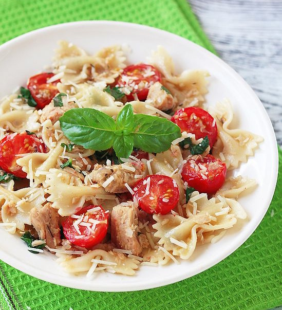

---
image: ../../pics/pasta-farfalle-s-tuntsom-i-pomidorami-cherri.jpg
---
# Паста фарфалле с тунцом и помидорами черри

#### Ингредиенты

* консервированный тунец 400 г
* паста фарфалле 200 г
* лук 1 шт.
* чеснок 3 дольки
* помидоры черри 150 г
* базилик 15 г
* оливковое масло 4-5 ст.л.
* розмарин, тимьян, орегано по 1/4 ч.л.
* соль, перец по вкусу
* тертый пармезан для подачи

#### Приготовление

Фарфалле отварить в подсоленной воде и откинуть на сито. Лук и чеснок мелко нарезать и обжарить на оливковом масле. Слить жидкость с тунца и вилкой размять его на небольшие кусочки.  
Добавить рыбу к луку с чесноком и готовить, помешивая, 1 минуту. Добавить специи, соль, нарезанные листья базилика и помидоры черри, готовить около 1 минуты.  
Добавить фарфалле, перемешать и готовить все вместе еще 1 минуту.  
Готовое блюдо посыпать тертым пармезаном и подавать немедленно.

*elena-fialka.livejournal.com*
