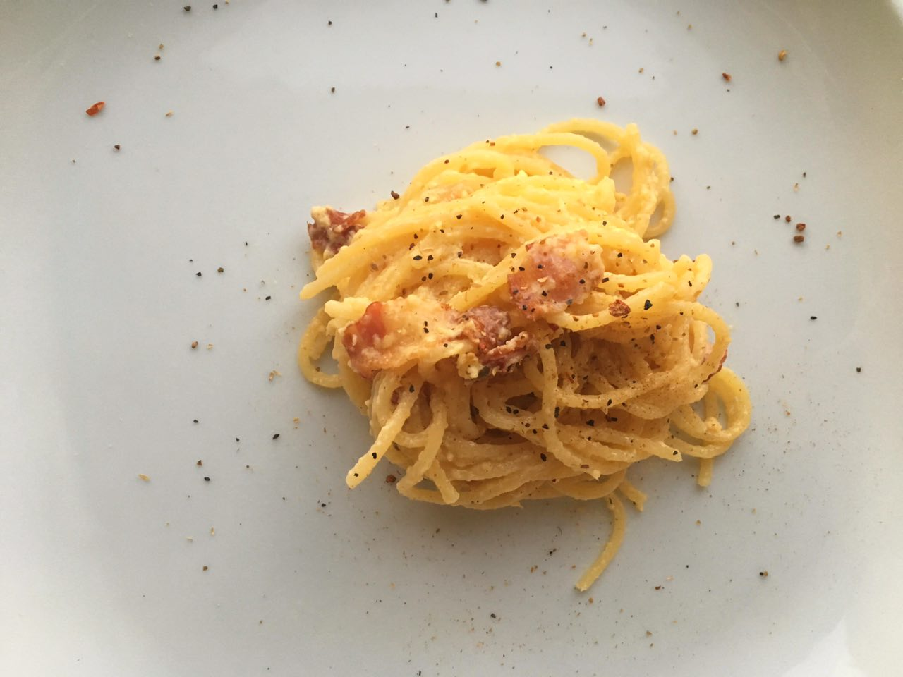

---
image: ../../pics/f2bd4be4-20c8-4b31-9f50-79eca8ffb242.jpg
---
# Паста Карбонара

#### Ингредиенты

1 порция \| 15 мин

* Панчетта по вкусу \(сырокопченая грудинка или бекон\)
* 30 г Пекорино \(Пармезан или Грана Падано\)
* 2 желтка
* черный перец
* оливковое масло

#### Приготовление

Большую кастрюлю воды поставить на огонь, воду хорошо посолить. Грудинку нарезать полосками или квадратами \(бекон просушить бумажным полотенцем\). Пармезан натереть в пыль В кипящей воде отварить спагетти. Разогреть сковороду с оливковым маслом и выложить грудинку, прожарить до хрустящести на среднем огне. Желтки отделить от белков и протереть желтки с сыром до однородной массы. Слегка твердые спагетти откинуть на дуршлаг, воду сохранить. Спагетти добавить на сковороду к грудинке, вылить туда смесь из яиц и сыра, хорошо перемешать, подливая воду из под спагетти до золотистой шелковистой структуры. Добавить свежемолотый черный перец.

*Tg: kuhnology*
