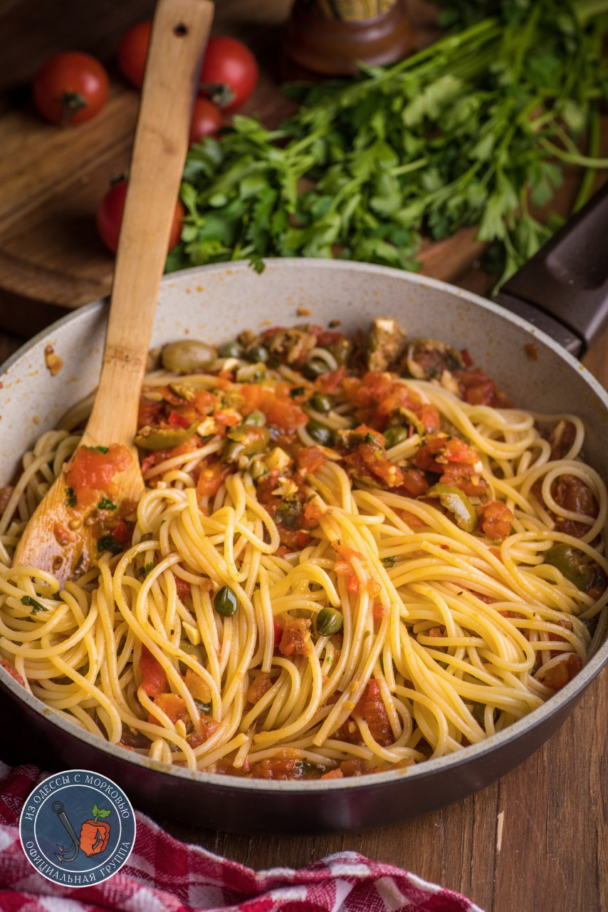

# Паста "путанеска" \| Spaghetti alla puttanesca

#### Ингредиенты

на 3 порции

* спагетти - 300 г.
* 3-4 зуба чеснока
* половина острого свежего перца
* Хлопья чили или раскрошенный сухой чили- пара щепоток.
* Оливковое масло - 60-70 мл.
* Томаты свежие или в собственном соку - 1кг
* Сухой орегано – 1 ч.л.
* Оливки - горсть
* Каперсы - 2 ст л
* Анчоусы в масле - 10 шт
* Петрушка, соль и черный перец - по вкусу
* пармезан или пекорино для подачи
* *вяленые томаты - по вкусу*

#### Приготовление

На среднем огне разогреть масло, добавить нарезанный мелко чили, чеснок и хлопья сухого чили. Готовить, потряхивая сковородой, пока чеснок лишь немного зарумянится.

Помидоры надрезать крест-накрест, залить кипятком на полминуты-минуту, затем окатить помидоры холодной проточной водой и снять кожуру. Сами помидоры разрезать пополам и с помощью чайной ложки убрать все семена. Помидоры нарезать кубиком, добавить в сковороду. Прибавить орегано и пару щепоток соли. Огонь немного поднять.Готовить, помешивая 15-20 минут на небольшом огне.

Добавить анчоусы, каперсы, почти всю нарубленную петрушку и оливки, вяленые томаты, если используем.

Отварить спагетти al dente: на 100г сухой пасты - минимум литр воды. Далее воду слить, спагетти переложить сразу в кипящий соус.

Добавить остатки петрушки, прогреть все с полминуты и подавать с мелко натертым пармезаном или пекорино.

*Sopranos. Family Cookbook*  
*Tg: OdessaCarrot*
