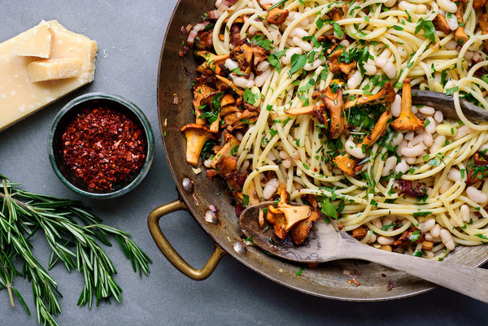

---
image: ../../pics/05kitch-web1-articlelarge-1.jpg
---
# Паста с лисичками и фасолью

#### Ингредиенты
на 4 порции

* 400 г консервированной фасоли
* соль и перец
* 85 г панчетты или бекона
* оливковое масло
* 1 средний красный лук
* 350 г лисичек
* 3 или 4 зубчика чеснока
* ¼ до ½ ч.л. хлопьев красного перца
* 1 ч.л. свежего розмарина
* 450 г букатини, спагетти или другой сухой пасты
* 2 ст.л. нарезанной петрушки
* соль и перец
* тертый сыр пармиджано или пекорино

#### Приготовление

Поместить панчетту в широкую, глубокую сковороду на среднем огне. Добавить 1 столовую ложку оливкового масла и перемешать равномерно, обжарить до золотистого цвета около 3 минут. Добавить лук, слегка посолить и готовить, помешивая, около 5 минут. Луковую смесь вынуть и отставить в сторону.

Вернуть сковороду на сильный огонь и добавить 2 столовые ложки оливкового масла. Когда масло нагреется, добавить лисички. Приправить щедро солью и перцем и обжаривать около 2 минут. Уменьшить огонь до среднего и добавить мелко нарезанный чеснок, хлопья перца и измельченный розмарин, готовить еще минуту, снять с огня.

Приготовить пасту, добавив при варке веточку розмарина.

Пока паста готовится, вернуть сковороду на средний огонь и добавить луковую смесь, фасоль и 50 мл жидкости \(вода от варки фасоли, бульон или вода\), довести до кипения.

Добавить готовую пасту в сковороду, прогреть еще около 1 минуты.

Подавать украсив петрушкой и тертым сыром.

*NY Times*
