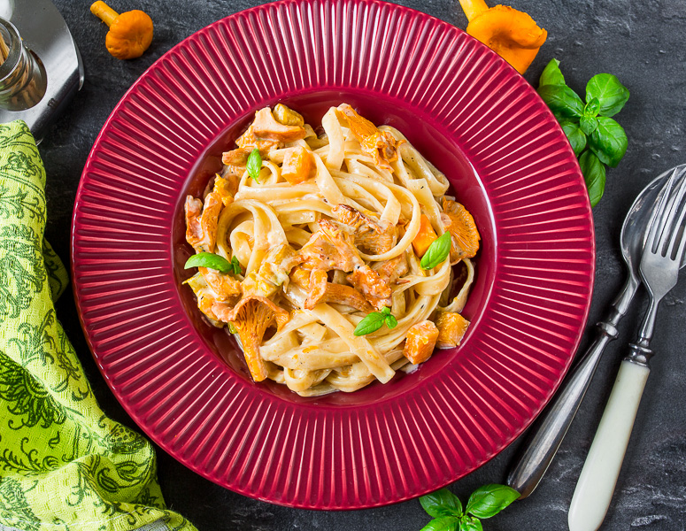

# Паста с тыквой и лисичками в сливочном соусе

#### Ингредиенты:

* 300 грамм спагетти, лингвини или другая сухая паста
* 2 зубчика чеснока
* 250 грамм тыква
* 300 грамм лисички
* 250 мл. сливки 20%
* 400 г куриный бульон
* 50 г сливочное масло
* 25 г сыр пармезан, тертый пармезан для подачи
* Петрушка
* Соль
* Перец

#### Приготовление:

На растительном масле обжарить лисички, добавить мелко нарубленный чеснок и обжаривать его вместе с грибами, помешивая, до сильного чесночного запаха. Добавить мелко нарубленной петрушки, перемешать и снять с огня.

В глубоком сотейнике растопить сливочное масло и обжарить на нем мелко нарезанную мякоть тыквы, посолить, поперчить и жарить еще пять минут, постоянно помешивая. Потом влить бульон, перемешать и варить еще десять минут, после ­чего добавить сливки, тертый пармезан \(25 г\), грибы с чесноком, перемешать, сделать огонь минимальным и варить до легкого загустения, время от времени, помешивая.

Приготовить пасту. Готовую пасту смешать с тыквенно-грибным соусом и подавать, посыпав свеженатертым пармезаном.

[_vkusnyblog_](https://www.vkusnyblog.ru/recipe/pasta-s-tykvoj-i-lisichkami-v-slivochnom-souse/) [_eda.ru_](https://eda.ru/recepty/osnovnye-blyuda/lapsha-s-tikvoj-gribami-18595)

