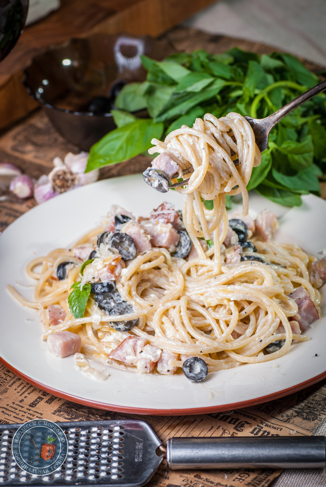

# Паста с ветчиной и оливками в сливочном соусе

#### Ингредиенты

* спагетти - 200-300г
* оливковое масло
* 1 банка маслин без косточки
* 250г ветчины
* 4-5 зубков чеснока
* полстакана жирных сливок
* пара ломтей бекона
* пармезан
* базилик

#### Приготовление

В глубокой сковороде нагреть оливковое масло. Чеснок раздавить лезвием ножа и измельчить.  
Добавить ветчину, нарезанную кубиком и тушить на маленьком огне минут 10. Не забывать помешивать.  
Оливки порезать и добавить к ветчине. Прогревать 5 минут.  
Посолить и приправить свежемолотым черным перцем.  
Влить сливки и прогреть.Буквально до минуты и на маленьком огне. Соус должен выйти шелковистым и однородным.  
Выложить отваренные спагетти в соус и прогреть минуту. Присыпать половиной пармезана и перемешать. Остальной пармезан добавить уже сверху, на готовую пасту.

*Tg: OdessaCarrot*
