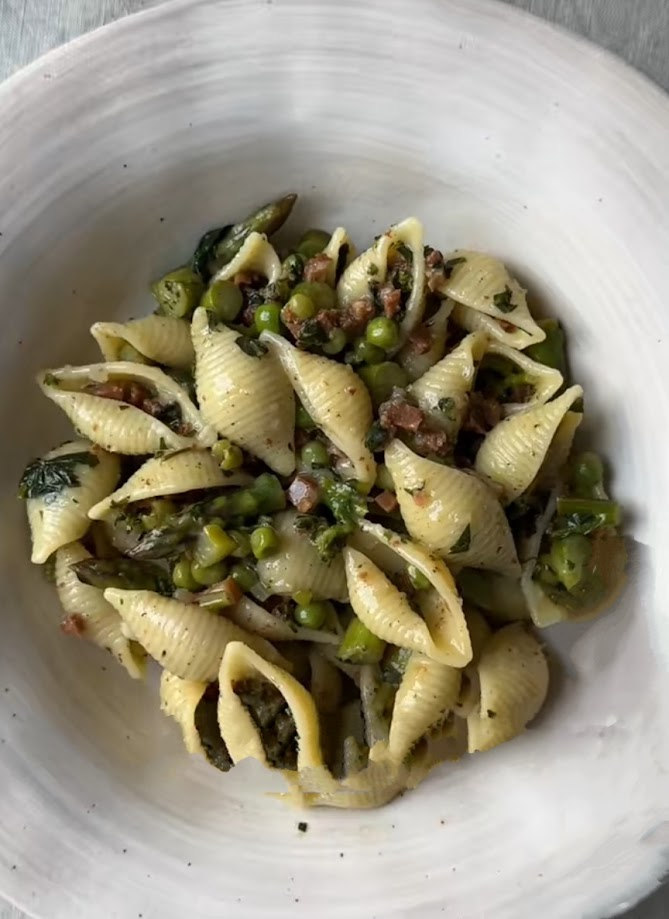

---
image: ../../pics/Img_2024_07_28_00_45_59~2.jpeg
---
# Паста с зеленым горошком, спаржей и базиликом

#### Ингредиенты

* паста ракушки
* зеленый горошек
* спаржа
* базилик
* бекон
* тертый пармезан

#### Приготовление

Пасту отварить al dente.  
Бекон мелко нарезать и обжарить, нарезать спаржу, добавить к бекону и обжарить пару минут.  
Добавить горошек, пасту, половник воды от пасты и пармезан. Перемешать до загустения и кремовости.

*TikTok: Sebastian Fitarau*
