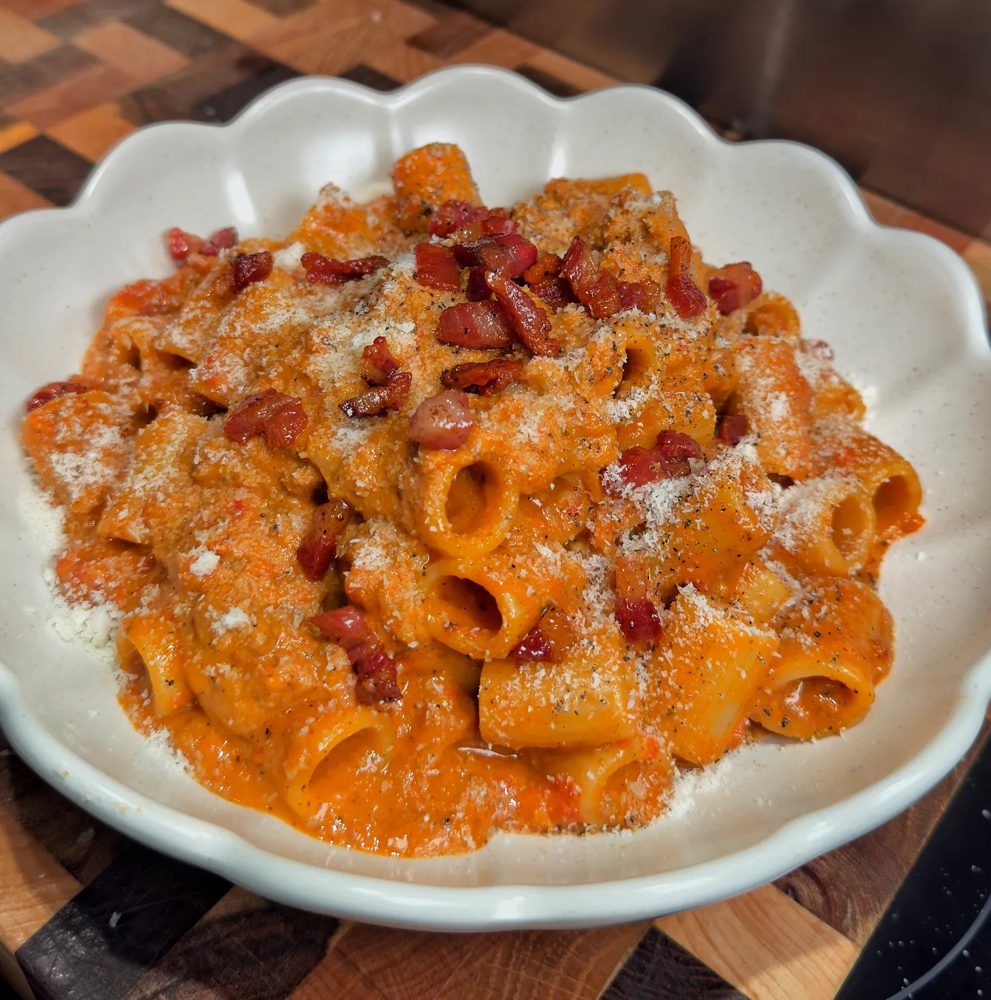

---
image: ../../pics/pasta-zozzona.webp
---
# Pasta alla Zozzona

#### Ингредиенты

* 2 яичных желтка
* сыр Пекорино Романо 30 г
* гуанчале или панчетта 60 г
* итальянские свиные колбаски 80 г
* томатная пассата 250 г
* ригатони 150 г
* соль, перец, хлопья паприки по вкусу

#### Приготовление

Панчетту нарезать кубиками. В большой сковороде приготовить панчетту на среднем огне, периодически помешивая, пока жир не вытопится. Снять с огня. Отложить на другую тарелку.

Разрезать колбаски и вынуть фарш. Выложить в сковороду и распределить фарш в один слой. Обжарить на среднем огне с одной стороны. Слегка приправить солью и перевернуть, продолжать готовить, пока весь фарш не прожарится. Добавить хлопья паприки, прогреть. Добавить пассату, слегка приправить солью и довести до кипения. Готовить до загустения, периодически помешивая около 10 минут.

Отварить пасту аль денте, переложить в соус, добавить немного воды от пасты.  
Еще немного воды от пасты смешать с желтком в другой миске, добавить пекорино, смешать до однородности. Приправить несколькими щепотками черного перца.   
Увеличить огонь до сильного и готовите, постоянно помешивая, пока соус не загустеет.

Снять сковороду с огня, добавить желтковую смесь, хорошо смешать все ингредиенты. Приправить солью и перцем по вкусу. Подавать немедленно, украсив тертым сыром и гуанчале.

*Tiktok: Notorious Foodie*
