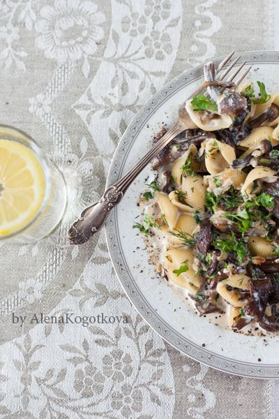

---
image: ../../pics/50ee5dcb53a0384a1c5a70081ca163dd.jpg
---
# Паста Фламбе с лесными грибами

Термин "фламбе" - от французского слова "flamber" - сгореть. Это кулинарный прием, при котором или в процессе приготовления блюда или во время подачи поливают крепкими алкогольными напитками и поджигают. Пламя быстро гаснет, а продукты приобретают неповторимый вкус и аромат и покрываются хрустящей корочкой.

#### Ингредиенты
на 2 порции

* 160 г фигурных макарон
* 100 г 11% сливок
* 30 г 22% сливок
* 1 средняя луковица
* 3 зубчика чеснока
* 250 г отваренных лесных грибов
* 40 г коньяка
* 3 ст.л. пармезана
* 1 ч.л. петрушки
* 1 ч.л. укропа
* 2 ст.л. масла виноградных косточек
* соль, черный молотый перец по вкусу

#### Приготовление

Отварить пасту al dente в достаточном количестве подсоленной воды. Сохранить 2-3 ст ложки воды от пасты.

Разогреть в сотейнике масло виноградных косточек, обжарить мелко нарубленный чеснок и некрупно нарезанный лук. Обжарить до золотистого цвета. Добавить грибы \(если крупные, нарезать\), обжарить.

Влить коньяк. Осторожно фламбировать. При фламбировании обязательно помнить о технике безопасности: поджигать в чугунной или стальной посуде, желательно с длинной ручкой, алкоголем облить продукты и немного нагреть, а только потом поджечь. Не наклоняться над посудой

Влить в сотейник сливки, довести до кипения, посолить и поперчить. Добавить готовую пасту и 2-3 столовые ложки воды. Всыпать натертый сыр и мелко нарезанную зелень. Перемешать. Готовить 1-2 минуты.

*alenakogotkova.livejournal.com*
