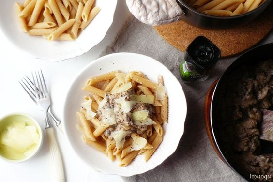

---
image: ../../pics/dd57d26c233b3ae8b2f3c9dc01fda419.jpg
---
# Паста с грибами и куриной печенью

#### Ингредиенты
на 3-4 порции

* ЦЗ паста
* 200 г куриной печени
* 100 г грибов
* 200 г сметаны
* 1 небольшая луковица
* 1 ст.л. сливочного масла
* свежемолотый перец
* *пекорино*

#### Приготовление

Лук нарезать произвольно. Печень нарезать небольшими полосками.  
На сливочном масле обжарить лук до золотистого цвета, добавить к нему грибы. Жарить 5 минут на сильном огне, постоянно помешивая. Добавить печень и жарить до готовности. Добавить сметану и свежемолотый перец, перемешать и готовить, помешивая, пока лишняя влага не выпарится.  
Отварить пасту.
Выложить в тарелки пасту, сверху печеночный соус. Также можно добавить тонкие ломтики пекорино и свежемолотый перец.

*imungu.livejournal.com*
