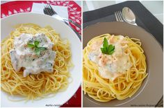

# Паста с лососем \| Паста с 2 лососями \|\| Pâtes au saumon \| Pâtes aux deux saumons

## Паста с лососем \(на фото слева\)

#### Ингредиенты
на 2 порции

* 250 г пасты
* 200 г филе свежего лосося
* 200 мл сливок
* сок половины лимона
* 2 ст.л. оливкового масла + 1 ст.л. для жарки
* 1 луковица
* 1 зубчик чеснока
* 1 пучок свежего базилика
* соль и перец

#### Приготовление

Подготовить маринад для лосося: порезать филе лосося на брусочки. В миске смешать несколько мелко порезанных листьев базилика, измельченный зубчик чеснока, крупно нарезанный лук и сок половины лимона, поперчить. Мариновать лосось в этой смеси в течение 20 минут.  
Отварить пасту в кипящей солёной воде al dente.  
Лосось вытащить из маринада.  
В сковороде с 1 ст.л. оливкового масла слегка обжарить брусочки лосося в течение 2-3 мин.  
В кастрюле с толстым дном подогреть сливки на медленном огне. Посолить, поперчить, добавить несколько мелко порезанных листьев базилика.  
Добавить в сливки лосось и тушить на медленном огне 2 мин.  
Пасту полить 2 ст.л. оливкового масла, добавить лосося и пару листьев базилика.

## Паста с двумя лососями \(на фото справа\)

#### Ингредиенты
на 4 порции

* 500 г пасты
* 300 г филе свежего лосося
* 100 г копченого лосося
* 200 мл сливок
* оливковое масло
* масло сливочное - 40 г
* соль и перец

#### Приготовление

Свежий лосось порезать на кубики 1х1 см.  
Копченый лосось порезать на тонкие полоски шириной 1 см.  
Нагреть растительное масло в сковороде. Добавить раздавленный чеснок, слегка обжарить и вытащить. Добавить в сковороду кубики свежего лосося.  
Обжарить на сильном огне \(примерно 10 сек\). Поперчить, посолить и добавить полоски копченого лосося. Залить рыбу сливками, потушить 1-2 мин на среднем огне. По окончании добавить в смесь сливочное масло, хорошо перемешать.  
Пасту отварить al dente и подавать с соусом.

*maria-cuisine.livejournal.com*