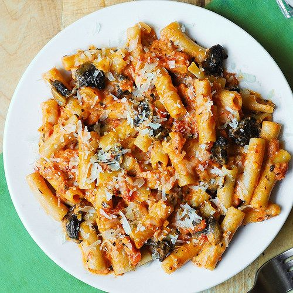

---
image: ../../pics/7c56ac22484368fa7257993bac1f06e1.jpg
---
# Паста пенне в сливочном томатном соусе с грибами и водкой

#### Ингредиенты
на 4 порции

* 1 ст л оливкового масла
* 4 зубчика чеснока, измельчить
* 14 унций \(400 г\) консервированных помидоров
* 3/4 чашки водки
* 1/2 чайной ложки измельченного красного перца
* 1 чайная ложка базилика \(если у вас есть свежий базилик - используйте больше\)
* 1/2 чайной ложки орегано
* 1 чашка грибов, нарезанных
* 1/2 стакана густых сливок
* 1/2 чашки 10% сливок \(half & half\)
* 3/4 чайной ложки соли или более
* 8 унций \(230 г\) пенне
* тертый пармезан

#### Приготовление

В большой сковороде обжарить чеснок в оливковом масле на среднем огне.  
Добавить помидоры, водку, измельченный красный перец, базилик, орегано.  
Довести смесь до кипения. Уменьшить огонь до и тушить под крышкой периодически помешивая в течение примерно 20 минут или пока соус не загустеет. За 10 мин до готовности добавьте грибы.  
Добавить сливки в соус и перемешать до равномерности. Добавьте 3/4 чайной ложки соли.  
В это время приготовить пасту в соответствии с инструкциями на упаковке. Промыть приготовленные макароны с холодной водой и обсушить. Добавить приготовленную пасту в соус и перемешать. Прогреть соус с пастой на медленном огне.  
Подавать посыпав пармезаном.

*juliasalbum.com*
