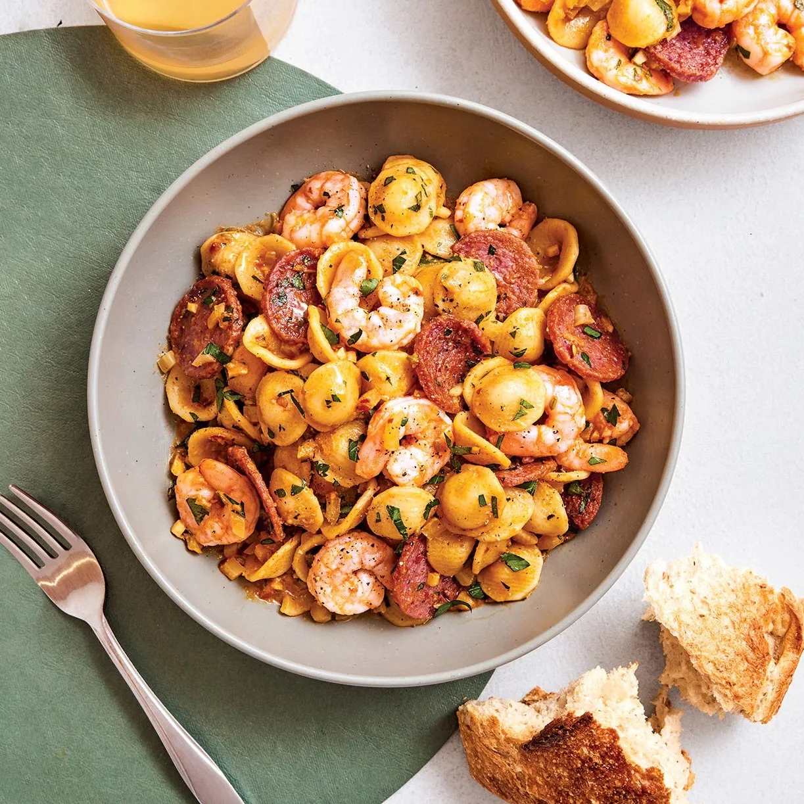

---
image: ../../pics/shrimp-salami-pasta.webp
---
# Паста с креветками и салями

#### Ингредиенты
на 4 порции

* креветки 400 г
* короткая паста 340 г
* салями 80 г
* сливочное несоленое масло 115 г
* цедра и сок 1 лимона
* чеснок 6 зубчиков
* хлопья красного перца 1 ст л
* семена фенхеля 1 ст л
* головка фенхеля 1 шт
* белое вино 1 чашка
* копченая паприка 1 ст л
* пучок петрушки

#### Приготовление

Отварить пасту al dente, слить воду, сохранив 1 чашку.

Салями нарезать тонкими колечками. Нагреть сковороду и выложить туда колбасу, без добавления масла. Готовить салями, время от времени переворачивая, пока она не станет хрустящей по краям (часть жира выпарится), 6–8 минут. Переложить на небольшую тарелку.

В той же сковороде разогреть сливочное масло. Добавить цедру лимона, чеснок, хлопья красного перца и семена фенхеля; готовить, часто помешивая, пока чеснок не станет золотистым, около 2 минут. Добавить нарезанный фенхель, посолить и готовить, часто помешивая, пока он не станет мягким, около 2 минут. Добавить вино и увеличить огонь до среднего; варить, периодически помешивая, пока практически не исчезнет запах алкоголя, около 3 минут. Добавить креветки и паприку и готовить, периодически помешивая, пока креветки не станут ярко-розовыми, около 2 минут.

Добавить макароны и отложенную жидкость от варки макарон в соус. Уменьшить огонь до среднего и готовить, часто помешивая, пока макароны не станут хорошо покрыты соусом и не станут блестящими, около 4 минут.

Снять пасту с огня, посолить и смешать с лимонным соком, петрушкой и салями.

Разложить пасту по неглубоким мискам или тарелкам для подачи.

*bonappetit.com*
