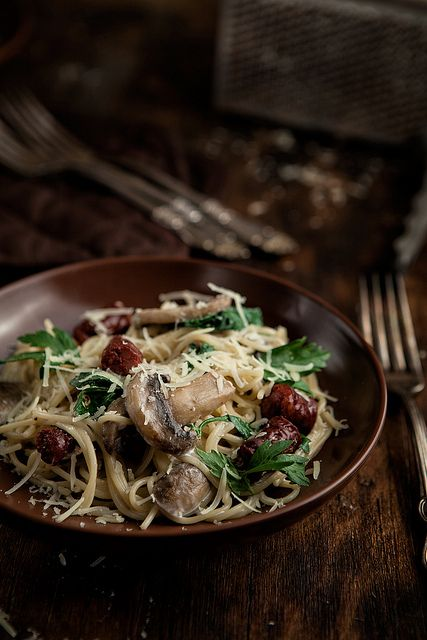

# Сливочная паста с грибами и охотничьими сосисками

#### Ингредиенты

* 200 г спагетти
* 150 г охотничьих сосисок или колбасок
* 400 г шампиньонов
* 2 зубчика чеснока
* 100 мл белого вина
* 300 мл сливок
* 3 ст.л. листьев петрушки
* тертый пармезан
* оливковое масло, соль, перец

#### Приготовление

Отварить пасту al dente.  
Сосиски нарезать и обжарить.  
Тонко нарезать грибы и обжарить на сильном огне около 3 минут, добавить чеснок и вино. Снизить огонь и подождать пока половина жидкости не испарится.  
Влить сливки, добавить петрушку, посолить, поперчить и добавить спагетти с сосисками.  
Подавать сразу, посыпав пармезаном

*mikeeats.livejournal.com*
