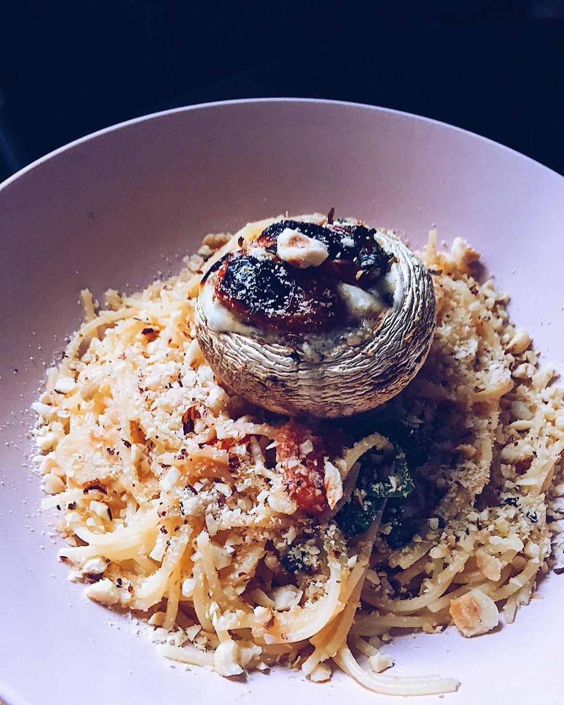

# Спагетти с чесноком и фундуком и запеченным шампиньоном

#### Ингредиенты

* спагетти
* шампиньоны
* греческий йогурт
* чеснок
* мускатный орех
* орегано
* томаты черри
* базилик
* шпинат
* фундук

#### Приготовление

Шампиньоны начинить кремом из греческого йогурта с молотым чесноком, мускатным орехом, орегано и морской солью, положить томат черри, базилик и шпинат и запечь под грилем минут 15.  
За это время отварить спагетти и добавить их в соус из подогретого в оливковом масле молодого чеснока и припущенных под крышкой черри и молодого шпината.  
Подавать, посыпав щедро поджаренным и измельчённым фундуком и с шампиньоном.

*Ig: etomoiabulochka*
