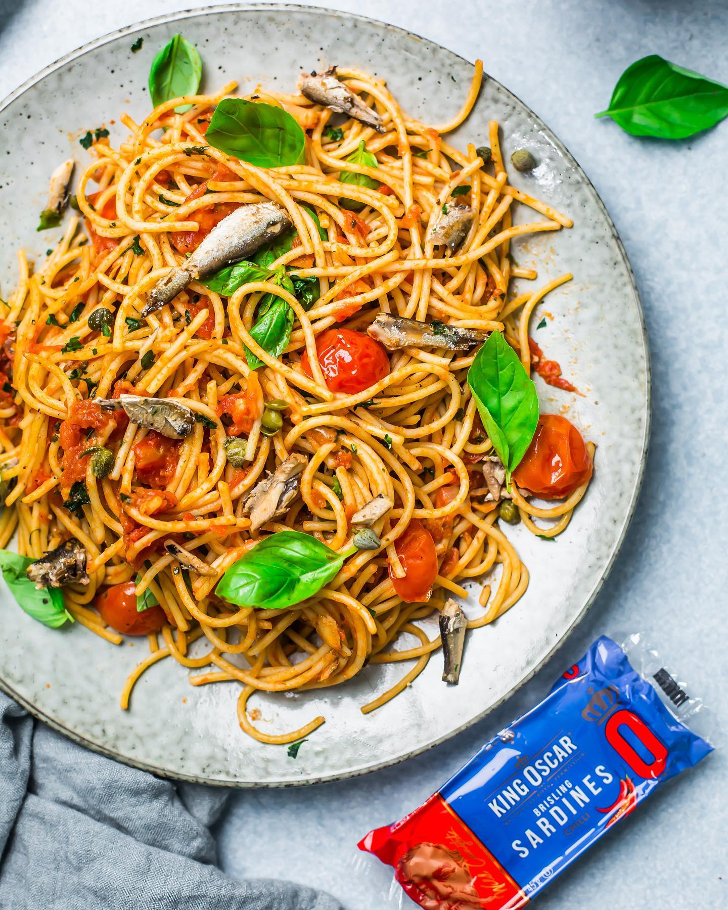

---
image: ../../pics/spagetti-sardines.jpg
---
# Спагетти с сардинами

#### Ингредиенты
на 2 порции

* 200 г спагетти
* 1 ст. л. оливкового масла
* 2 зубчика чеснока
* 1 ч. л. хлопьев чили
* 250 г консервированных помидоров
* горсть томатов черри
* 60 г сардин
* 1 ст. л. каперсов
* свежая петрушка
* свежий базилик

#### Приготовление

Отварить спагетти в большой кастрюле с кипящей подсоленной водой.  
Мелко нарезать чеснок и петрушку. Нарезать консервированные помидоры кубиком, черри - пополам.  
Приготовить соус. В сковороде обжарить чеснок - 1 минуту. Добавить хлопья чили, помидоры и сардины, готовить 2–3 минуты, затем добавить каперсы и половину петрушки, хорошо перемешать.  
Добавить пасту в соус и хорошо перемешать, добавив оставшуюся воду от пасты, если соус немного густоват.  
Подавать украсив петрушкой и базиликом.

*ig: sugaretal*
