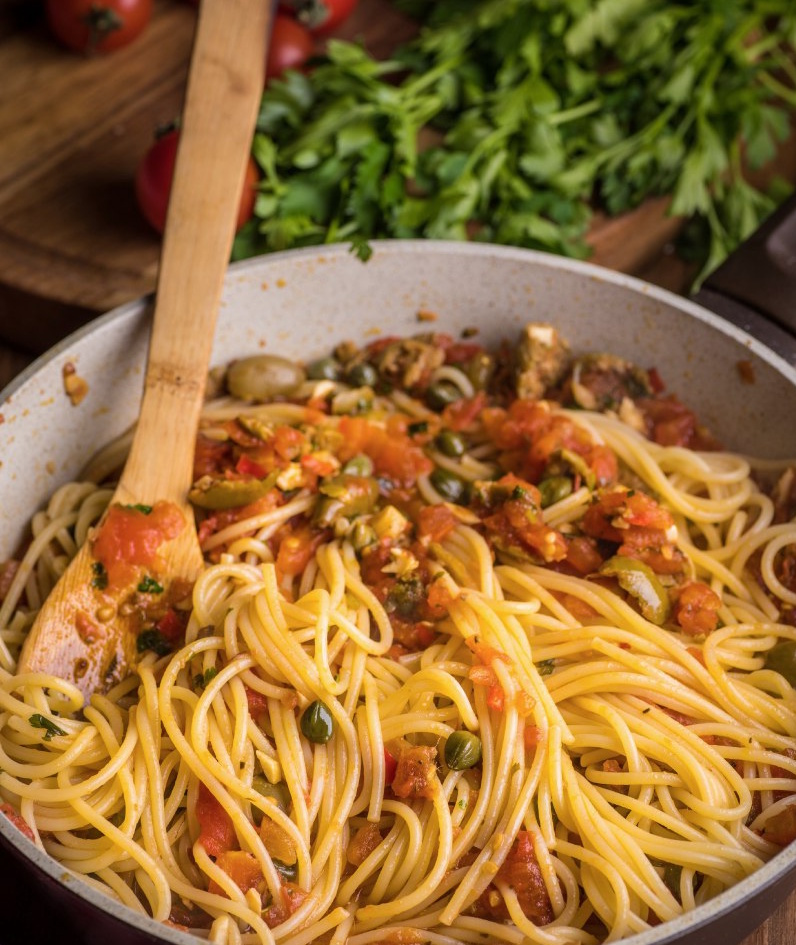

---
image: ../../pics/spaghetti-puttanesca.jpg
---
# Паста "путанеска" \| Spaghetti alla puttanesca

#### Ингредиенты

на 2 порции

* спагетти 200 г
* чеснока 2 зубчика
* острый свежий перец половина
* хлопья чили или раскрошенный сухой чили пара щепоток
* оливковое масло 30 г
* томаты собственном соку 600 г
* сухой орегано 1 ч л 
* оливки
* каперсы 2 ст л
* анчоусы в масле 6 шт
* петрушка, соль и черный перец по вкусу
* пармезан или пекорино для подачи
* *вяленые томаты по вкусу*

#### Приготовление

На среднем огне разогреть масло, добавить нарезанный мелко чили, чеснок и хлопья сухого чили. Готовить, потряхивая сковородой, пока чеснок лишь немного зарумянится.

Помидоры надрезать крест-накрест, залить кипятком на полминуты-минуту, затем окатить помидоры холодной проточной водой и снять кожуру. Сами помидоры разрезать пополам и с помощью чайной ложки убрать все семена. Помидоры нарезать кубиком, добавить в сковороду. Добавить орегано и пару щепоток соли. Огонь немного поднять. Готовить, помешивая 15-20 минут на небольшом огне.

Добавить анчоусы, каперсы, почти всю нарубленную петрушку и оливки, вяленые томаты, если используем.

Отварить спагетти al dente: на 100г сухой пасты - минимум литр воды. Далее воду слить, спагетти переложить сразу в кипящий соус.

Добавить остатки петрушки, прогреть все с полминуты и подавать с мелко натертым пармезаном или пекорино.

*Sopranos. Family Cookbook*  
*Tg: OdessaCarrot*
