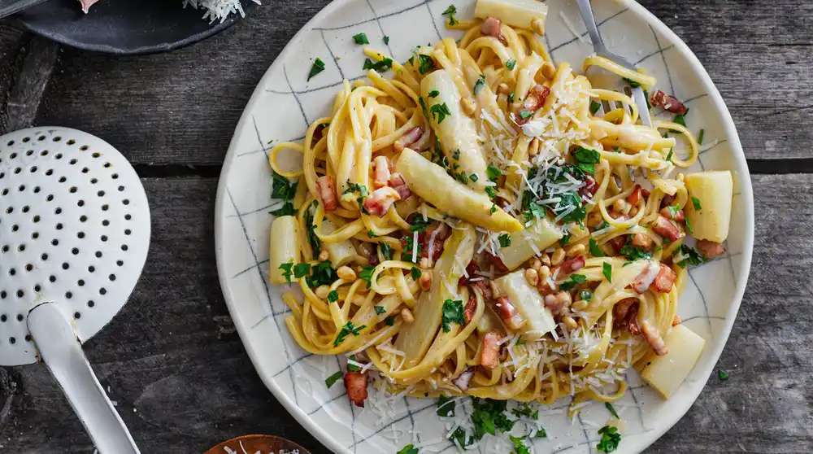

---
image: ../../pics/white-asparagus-pasta.webp
---
# Паста с белой спаржей и беконом

#### Ингредиенты
на 2 порции

* белая спаржа 4 шт
* куриный бульон 50 мл
* 1 лимон
* холодное сливочное масло 25 г
* сливки 35% 150 мл
* бекон 70 г
* петрушка
* черный перец

#### Приготовление

Очистить спаржу и нарезать ее на более мелкие кусочки. Нижнюю половину использовать для соуса. 

Растопить 30 граммов сливочного масла, пока оно не потемнеет. Добавить нижнюю половину спаржи и слегка обжарить на сливочном масле. 

Пасту отварить согласно инструкции в подсоленной воде. Влить сливки и уварить их вдвое, добавить 50 мл куриного бульона и 50 мл воды от пасты. Перемешать до однородной массы. Натереть цедру лимона и заправить лимонным соком. Добавить оставшуюся спаржу и варить на медленном огне до тех пор, пока она не станет мягкой, 2–3 минуты.

Добавить пасту и оставшееся масло, тщательно перемешать. Обжарить бекон до хрустящей корочки и выложить на бумажные полотенца.

Подавать в миске, украсив беконом, петрушкой и свежемолотым черным перцем.

*ig: klarasmat*
