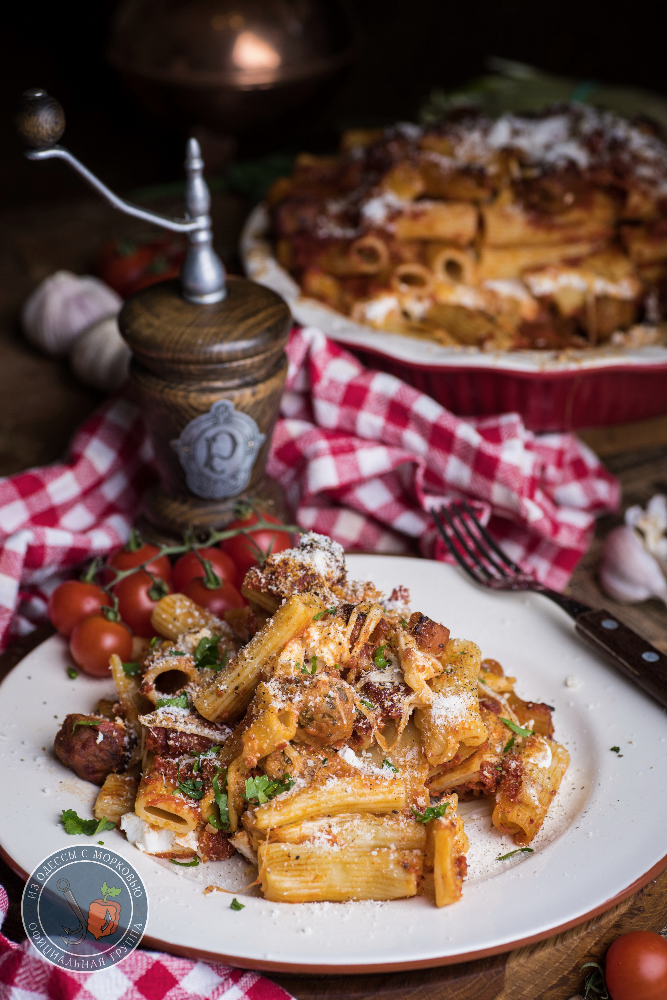

# Ziti al forno  \| Зити запеченные в томатном соусе с маленькими фрикадельками

## Ингредиенты:
**для соуса:**
* 2ст.л. оливкового масла
* 4 зуба чеснока
* 2-3 ст.л. вкусной томатной пасты
* 800г банка помидор в собственном соку
* Соль и черный перец из мельницы
* 1чл орегано
* 1чл базилик
* _1.чл. Сахар_

**для фрикаделек:**
* 500г говяжего фарша
* 60г крупных сухарей
* 2 яйца
* 1 зуб чеснока
* 50 г натертого мелко пекорино романо или пармезана
* 2 ст.л. мелконарубленной петрушки
* 1 ч.л. соли
* черный перец

* паста зити (или пенне, короткие макароны или ригатони) – 500г
* 100г пекорино романо или пармезана
* 250г рикотты или сухого творога
* 250г моцареллы

## Приготовление:

Приготовить соус. Помидоры очистить и размять вилкой вместе с соком.  В сковороде разогреть оливковое масло и на небольшом огне, переворачивая, обжарить чеснок, так, чтобы он подрумянился со всех сторон 2-3 мин. Удалить чеснок, добавить томатную пасту и готовить, помешивая около минуты. Влить помидоры, орегано, базилик, соль и черный перец. Если консистенция кажется слишком густой, добавить воды.  Довести до кипения, снизить огонь до минимума и готовить при полуприкрытой крышке 30-40 минут, периодически помешивая. При необходимости доавить воды.

Приготовить фрикадльки. В просторной миске соединить все компоненты, тщательно вымешать. Поставить рядом емкость с водой и смачивая пальцы надо сформировать маленькие фрикадельки, размером с крупную виноградину или маленький черри. В сковороде разогреть пару столовых ложек масла и на умеренном огне обжарить фрикадельки до золотистого, румяного цвета со всех сторон. Готовить партиями, не перегружая сковороду.

Когда соус будет готов, переместить в него фрикадельки и томить на минимальном огне полчаса-минут 40 до готовности фрикаделек.

В большой кастрюле довести до кипения минимум 4 литра воды, всыпать зити , перемешать и готовить до состояния аль денте. Слить воду и переложить отдельно в подходящую миску. Влить 2-3 небольших половника соуса и половину натертого пармезана и перемешать

Разогреть духовку до 170С.

Выложить половину зити в форму для запекания с высоким бортом, сверху распределить рикотту, поверх рикотты раскрошить моцареллу, сверху присыпать половиной оставшегося пармезана. Влить половник соуса. Уложить оставшиеся зити и полить соусом, присыпать пармезаном. 

Накрыть фольгой и запекать 35-40 минут. Убрать фольгу и готовить еще 15-20 минут или до тех пор, пока соус по краям не начнет слегка пузыриться. Достать из духовки, накрыть той же фольгой и остудить 15 минут.

Подавать теплым, посыпанным пармезаном. 

*https://telegra.ph/Ziti-al-forno-Vselennaya-Kuhnya-Semi-Soprano-03-19*

