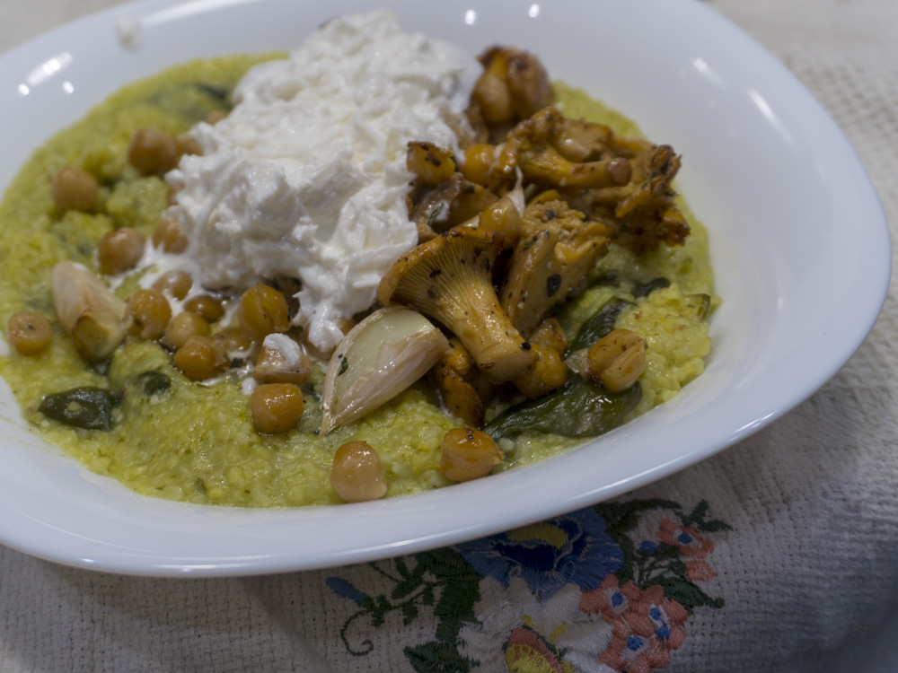

---
image: ../../pics/dsc05553.jpg
---
# Полента с лисичками, нутом и песто

#### Ингредиенты:

на 2 порции

* 2 ст л оливкового масла
* 250 г лисичек
* 0,3 банки консервированного нута
* свежий тимьян
* 6 зубчиков чеснока
* свежемолотый черный перец
* хлопья чили перца
* соль
* 1 или 0.5 буратты на порцию

**для поленты:**

* 80 г поленты
* 10 г сливочного масла
* пучок шпината
* 4-5 очищенных зубчиков чеснока
* 2 ст л базиликового песто

#### Приготовление:

Разогреть духовку до 160°С. В миске хорошо перемешать вымытые грибы, нут, оливковое масло, неочищенные зубчики чеснока и все специи. Выложить все на противень с ковриком или пергаментом, противень поставить в верхнюю треть разогретой духовки. Запекать 25 - 30 минут, пока не зарумянится нут. Увеличить температуру до 250°С и включить верхний гриль, запекать еще около 5 минут, следить, чтобы не начало подгорать.

Пока запекаются грибы, приготовить поленту. На среднем огне разогреть примерно стакан воды в сотейнике до 40°С \(чуть теплая вода\). Добавить всю поленту, увеличить огонь и довести до кипения постоянно помешивая. В кипящую воду добавить сливочное масло и шпинат, перемешать. Когда шпинат размягчится, уменьшить огонь до низкого и помешивать пока не выпарится вода еще примерно 5 минут, добавить песто и перемешать.

Для подачи выложить поленту в глубокие миски, сверху выложить грибы и нут, буратту разрезать и выложить на грибы. Украсить песто и зеленью.

[_https://www.halfbakedharvest.com/pesto-polenta-with-thyme-roasted-mushrooms-and-chickpeas/_](https://www.halfbakedharvest.com/pesto-polenta-with-thyme-roasted-mushrooms-and-chickpeas/)

